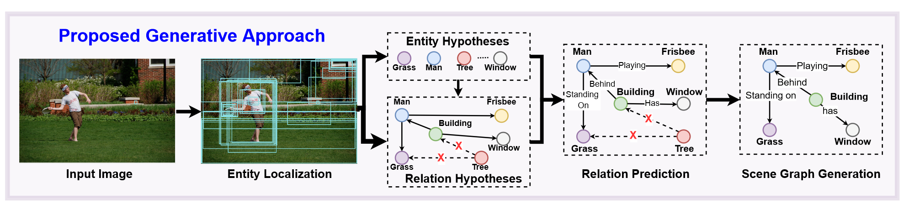

# IS-GGT: Iterative Scene Graph Generation With Generative Transformers

## 背景

基于图谱的视觉表示由于能编码视觉、语义甚至时序上的关系，受到越来越多的关注。它能应用于一些下游任务，比如物体追踪，场景理解，甚至复杂的视觉常识推理。图谱能从视觉输入中表达复杂的语义结构，并消除噪声、杂乱和外表差异的影响，这对场景理解非常重要。场景图谱被定义为一个有向图，能够建模给定场景的实体中的视觉语义关系，这对包括视觉问答、文字说明、具身任务比如导航等下游任务非常有用。

目前已经有很多任务关注于场景图谱生成（SGG）这一问题。SGG能从一个给定的输入观察中生成场景图谱。然而，这种方法解决的思路是开始于一个全连接的图谱，之后通过预测边来缩减为一个更加紧凑的图谱。这种方法虽然有效，但是也有一些局限。首先，通过建模实体之间的拓扑关系，潜在的语义结构会在关系推理中被忽视，这会导致很差的谓语分类。其次，通过对所有在一个场景中的实体中配对关系进行构建，时间负载上会随着实体数量的增加呈现非线性的增长。这两个问题会同时加剧目前的SGG长尾分布问题。目前在去偏执上的进展尝试通过处理长尾分布问题来解决这一问题。然而，他们会依赖于潜在SGG方法质量，受到以上问题的局限。

## IS-GGT

本文目标为使用一个双阶段、生成式的方法IS-GGT来解决上述局限。这是一个基于transformer的迭代式场景图谱生成方法。与目前SGG的方法不同，本文利用生成式图谱模型上取得的进展来采样检测到的实体之间的潜在关系图谱，之后对这一采样的语义结果进行推理，从而进行SGG。通过将图谱生成和关系建模的思想进行分离，本文可以限制关系分类过程，使其只考虑那些有更高联系概率的边，从而在推理时见效计算负载。

IS-GGT方法有三个主要的部分：概念定位、结构推理和关系推理。鲫鱼生成式图谱模型的思路，本文使用场景级定位和实体概念假设来用一个生成式的trnaformer decoder网络提取场景中的语义结构。一旦语义结构被提取，语义关系就会被打上标签，使其具有场景图谱的特征。

**问题陈述**：场景图谱生成（SGG）的目标是根据一张给定的图片$I$生成一个图谱结构$\mathcal{G} = \{\mathcal{V}, \mathcal{E}\}$。其中，$\mathcal{V} = \{v_1, v_2, \dots, v_n\}$为图像中的图谱表示定位的实体的结点；$\mathcal{E} = \{e_1, e_2, \dots, e_k\}$为描述两个结点$n_i$和$n_j$之间关系的边。每个结点$v_i \in \mathcal{V}$包含着两个属性，一个标签$l_i \in \mathcal{C}_\mathcal{N}$和一个检测框$bb_i$，其中$\mathcal{C}_\mathcal{N}$为环境中所有可能概念的空间。每条边$e_i \in \mathcal{E}$由一个标签$r_i \in \mathcal{R}_\mathcal{K}$和一个可选的断言分数$p(r_i)$定义，其中$\mathcal{R}_\mathcal{K}$为实体$\mathcal{C}_\mathcal{N}$之间所有可能关系的集合。

之前的方法通过一个关系预测模型从所有可能的关系中选择出合理的关系。相比之下，本文在关系分类前首先基于结点假设采样出潜在的语义结构来进行建模。

**实体假设**：场景图谱生成过程开始于实体假设生成，其中包括在给定图片$I$中的概念定位和识别。按照之前工作的思路，本文使用一个标准的基于ResNet的FasterRCNN模型座位定位模块。物体检测器会返回$n$个检测出的实体$v_1, v_2, \dots, v_n$，并用检测框$bb_1, bb_2, \dots, bb_n$和标签$l_1, l_2, \dots, l_n | l_i \in \mathcal{C_N}$表示。这些实体$\mathcal{V}$被用作本文的结点假设空间。每个实体被视为从潜在ResNet编码器得到的特征表示$f_N^i$。

**迭代式交互图谱生成**：

生成式图谱采样的第一步通过迭代式地根据输入图像构建潜在的实体联系图谱，将无法加入场景语义结构的检测到的实体拒之门外，从而清除了杂乱的信息。

关系预测模型会根据这个限制的边列表进行推理，从而分类相互关联的实体中的关系。

因此，关系推理机制仅仅考虑了场景的全局语义结构，进行更加一直的关系预测，在没有额外去偏执和计算负载的情况下帮助处理了长尾分布问题。

## 实验结果

大量在Visual Genome数据集上的实验表现了提出的方法上的有效性。

## 个人感想

1. 与目前的SGG方法进行比较。
2. 结合下游任务，生成更适合的图谱。
3. 将所有多模态任务转接为图谱问题，让G-Retriever适用范围更广。
