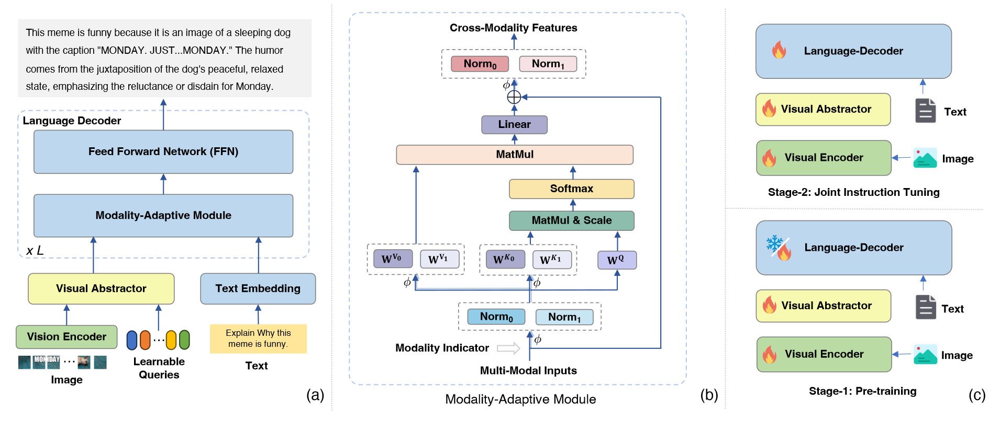

# mPLUG-Owl2: Revolutionizing Multi-modal Large Language Model with Modality Collaboration

## 背景

像GPT-3、LLaMA、GPT-4这样的大语言模型（LLM），由于它们在文本理解和泛化上出色的泛化能力，受到大家广泛的关注。为了促进视觉语言任务的应用，GPT-4V在多个任务中展示了令人印象深刻的多模态能力，比如描述、问答任务。这让研究者开始关注于视觉语言领域中的潜在关联，导致了一系列多模态大预言模型的出现。这使得大语言模型具备了理解并处理视觉问题的能力。

但是，目前的方法仅仅关注于提升处理多模态任务的能力，忽略了单模态性能的保证。最近的工作使用了跨模态的对齐模块来将视觉编码器输出的视觉特征映射到预训练的LLM上，从而通过使用已有的语言能力来处理多模态任务。另外，一些研究者在多模态指令微调的时候也顺便把LLM微调了。这虽然提升了处理多模态任务的能力，但是这削弱了其单独处理文本任务的能力。

目前的主要挑战是：运用一个单独的模块来平衡模态联合（多模态）和模态推理（单模态）的增益，保证模态能在多模态的指导数据集上相互交互。

## mPLUG-Owl2

### 架构介绍

本文将引入mPLUG-Owl2，一个全能的多模态大模型，它有效利用了模态融合来同时提升文本和多模态任务。

mPLUG-Owl2使用一个模块化的网络结构，包括了一个视觉编码器、一个视觉提炼器、一个文本嵌入层、一个语言解码器。具体来说，本文使用ViT-L/14作为视觉编码器，将LLaMA-2-7B作为语言解码器。

---

- 视觉编码器使用$H\times W$的分辨率处理输入的图谱，并生成大小为$\frac{H}{14} \times \frac{W}{14}$的token序列。
- 上述视觉token特征与文本token嵌入合并，喂入语言解码器中。
- 语言解码器被用作一个处理不同模态的通用接口。这样，视觉和语言模态被映射进一个跨模态共享的语义空间上，同时模态特定特征也有所保留。

---

但是，随着图像分辨率的提升，编码后的视觉token序列会成指数地增长。另外，图像中充分冗余导致了计算上的浪费和不小的噪声。为了解决这个问题，本文提出一个配备有一组固定可学习的请求的**视觉提炼器**来从图像中提取更高的语义特征。

具体来说，本文喂入提取的视觉token序列$\mathcal{I} = [I_1, I_2, \cdots, I_P] \in \mathbb{R}^{P\times d}$和固定$K$个的可学习请求$\mathcal{Q} \in \mathbb{R}^{K\times d}$进入视觉提炼器。在视觉提炼器中，$P = \frac{H}{14} \times \frac{W}{14}$表示这视觉patch的数量，$D$代表隐藏维度。视觉提炼器包含了一系列视觉提炼层。在第$i$层中，压缩的视觉表示$\mathcal{V}$由如下公式进行计算：

$$\begin{aligned}
\mathcal{C}^i &= Attn(\mathcal{V}^i, [\mathcal{I};\mathcal{V}^i],[\mathcal{I};\mathcal{V}^i])\\
\mathcal{V}^{i+1} &= SwiGLU(\mathcal{C}^iW_1)W_2
\end{aligned}$$

其中，$Attn(\cdot, \cdot, \cdot)$表示自注意力函数、$W_1 \in \mathbb{R}^{d\times d'}$和$W_1 \in \mathbb{R}^{d'\times d}$为可学习的参数、$SwiGLU(\cdots)$为SwiGLU激活函数。本文将$\mathcal{V}^0 = \mathcal{Q}$来初始化提炼。（注意一下，注意力函数的输出和第一个参数大小一样）

此外，为了增强细粒度感知能力，本文将正弦位置嵌入和视觉特征$\mathcal{I}$、$\mathcal{V}^i$进行整合，从而保留文职信息，相关论文论证了这一处理的有效性。

---

通过上述方法，语言解码器的计算量从$O((P+L)^2)$降为了$O((K+L)^2)$，如果$P \gg K$就会很大程度减少计算负载，这对那些图片数量很多、文本长度$L$很短的场景很友好。一旦压缩后的视觉特征被获取了，它会与文本token特征合并，通过语言解码器来生成预测。

### 模态适应模块

先前的方法将视觉特征映射到语言语义空间上会导致颗粒度的不匹配（视觉特征含有丰富的语义信息、文本特征只含有零散的语义信息），从而限制了模型的表现。

mPLUG-Owl2引入一个模态适应模块来保留特定模态特征（MAM），通过将视觉特征和语言特征映射到共享的语义空间上，从而分离视觉语言表示。同时，也保留了各个模态的独特特性。

具体来说，给定一个视觉语言序列$X \in \mathbb{R}^{(L_V + L_T) \times d}$和模态指示器$M \in \{0, 1\}^{(L_v + L_T)}$，模态分离函数$\phi$如下所示：

$$\phi(X, M, m) = X \odot \mathbb{1}_{\{M=m\}}$$

其中$m \in \{0, 1\}$为模态类型。给定先前层的输出向量$H_{l - 1}, l \in [1, L]$，其中$L$为语言解码器的层数。本文首先将不同的模态标准化为相同的量级：

$$\tilde{H}_{l - 1} = LN_V(\phi(H_{l - 1}, M, 0)) + LN_T(\phi(H_{l-1},M,1))$$

其中$LN_V$和$LN_T$分别为视觉特征和语言特征的layer normalization。之后，本文通过对key投射矩阵和value投射举证使用分离线性映射层，构建出自注意力函数。同时，保留了query投射矩阵。公式如下所示：

$$\begin{aligned}
H_l^Q &= \tilde{H}_{l - 1}W_l^Q\\
H_l^K &= \phi(\tilde{H}_{l - 0}, M, 0)W_l^{K_0} + \phi(\tilde{H}_{l - 1}, M, 0)W_l^{K_1}\\
H_l^V &= \phi(\tilde{H}_{l - 0}, M, 0)W_l^{V_0} + \phi(\tilde{H}_{l - 1}, M, 0)W_l^{V_1}\\
C_l &= Softmax \left( \frac{H_l^Q H_l^{K^T}}{\sqrt{d}} \right)H_l^V
\end{aligned}$$

其中，$W_l^Q, W_l^{K_0}, W_l^{K_1}, W_l^{V_0}, W_l^{V_0} \in \mathbb{R}^{d \times d}$是可学习的映射矩阵，$C_l \in \mathbb{R}^{(L_V + L_T) \times d}$为第$l$层的上下文特征。按照这种方法，我们可以计算在共享语义空间内的两个模态的相似度，也能通过不同的value映射层保留每个模态的独特模态特征。

此外，通过分离key、value映射矩阵，本文可以避免两个模态间的干扰（尤其是颗粒度不匹配）。同样地，本文也通过利用不同层的标准化层对这些特征进行建模。最后，为了在相同的特征空间内提升模态的联合，本文对所有模态使用一个共享的FFN。本文就是这样通过模态适应模块既实现了模态交互，也保留了模态特征。

---

此外，本文引入一个双阶段训练范式，包括了视觉语言预训练和联合视觉语言指令微调。这一范式通过两个阶段来训练视觉编码器，使其同时有效捕捉低层级和高层级的语义视觉信息。

## 实验

实验展示了mPLUG-Owl2能够同时在文本任务和多模态任务泛化，并用一个**单一通用模型**在8个经典的视觉语言benckmark上取得SOTA效果。

此外，mPLUG-Owl2在5个最近零样本多模态benchmark上获得了数一数二的效果，展示了其在多模态指示理解和生成上的适应性和有效性。

还有，mPLUG-Owl2也在多个纯文本benchmark中也取得了SOTA结果。

另外，本文通过深度分析展示并验证了本文提出的模态适应模块的效果，尤其是在提升包括理解、知识、推理在内的文本任务上。

值得注意的是，mPLUG-Owl2是第一个在同时纯文本和多模态场景中展示模态联合现象的多模态大语言模型，为未来多模态基础模型的发展开创了一条道路。
