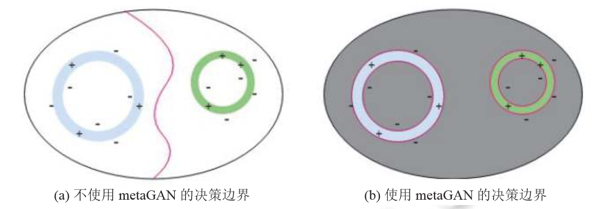
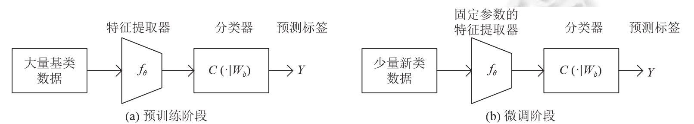
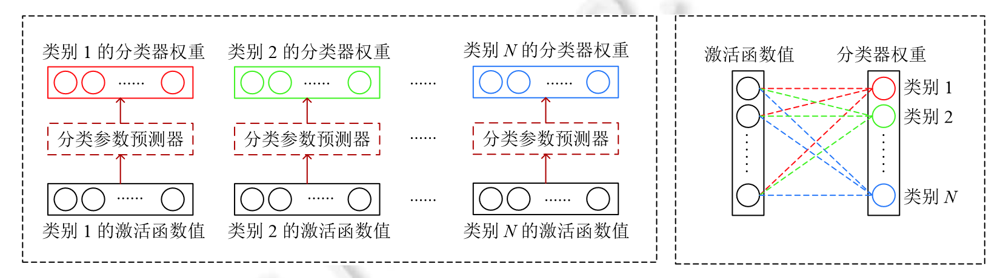

# 小样本困境下的深度学习图像识别综述

## 背景

深度学习方法极大依赖于大规模标注数据，而这极大限制并影响了其在广大领域的应用。首先，标注数据涉及到隐私问题；其次，也涉及到人力物力的耗费问题；最后，算力上也对硬件设备要求高。

### 小样本学习

目前经常研究的问题为N-way K-shot形式，即问题包括N种数据，每种数据只包含K个标注样本。

## 主流方法

### 数据增强

通过算法生成人工标注数据，扩充原有的数据量。其中，一种方法是用生成的伪数据来补充小样本数据；另一种方法是用伪数据锐化分类算法学习到的决策边界。

#### 伪数据补充

这种方法并不能有效帮助模型识别类内差异，非常依赖于原有数据集。

- **delta-encoder**：自编码器结构，将标注充分的数据进行学习，再将此信息应用辅助少量标注的数据上。
- **dual TriNet**：基于语义空间的数据增强，通过ResNet-18实现多级深度特征提取。并通过TriNet将特征映射到语义空间上；通过图片相似的语义上相近，将最相似的类别特征加入高斯噪声，输入人TriNet解码模块；输出的深度特征就可以用来进行数据增强。

#### 伪数据锐化

将生成的伪数据锐化决策边界，提升分类技能。

**metaGAN**：通过将GAN生成的伪数据作为一个新类别（fake class）以此来改善决策边界。

优势：算法简单，对生成器的训练要求低。

### 迁移学习

将模型再大数据集上进行预训练，获得一些先验知识，从而弥补数据不足的问题。

人们普遍认为，神经网络中特征的复杂性是随着网络深度加深而提高的。因此，网络前几层的特征一般是相似的、与任务无关的；而网络的高层特征不适合在任务之间共享。

#### 基于微调

微调的基本方法：在大数据上进行预训练。之后固定底层特征权重，只对网络高层的权重使用目标数据进行反向传播更新。

- **Baseline++**：微调阶段只改变分类器的权重。同时，将向量积换成了计算向量夹角余弦值运算，通过消融实验证明了对小样本学习表现更好。

- **Transducive fine-tuning**：利用香农熵作为正则项加入损失函数，惩罚分类结果较为均匀的情况，让预测结果趋于集中，从而获得优秀的表现。

#### 基于前向传播

- **Dynamic Few-Shot Learning**：预训练之后，对于新类将特征嵌入的平均值作为分类权重。两者一起对网络所有层进行微调。

- **Predicting Parameters from Activations**：对特征提取器和基分类器进行预训练之后，用小样本数据来训练参数映射网络，特征激活 + 权重映射网络即为分类器权重。

迁移学习存在一些可改进的地方：1. 深层特征的信息量巨大，但是没有被利用好；2. 缺乏可解释性。

### 元学习
