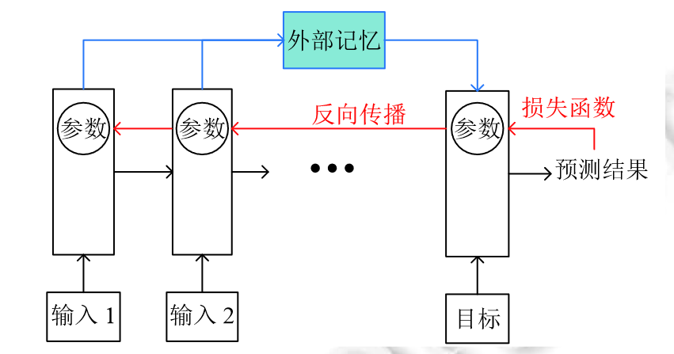
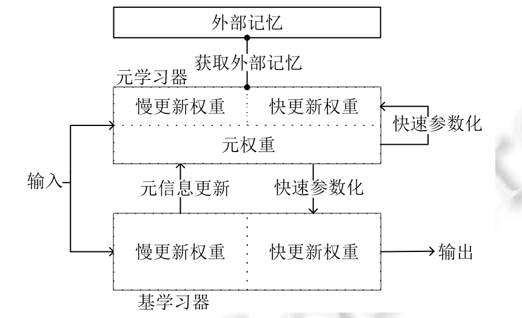

# 小样本困境下的深度学习图像识别综述

## 背景

深度学习方法极大依赖于大规模标注数据，而这极大限制并影响了其在广大领域的应用。首先，标注数据涉及到隐私问题；其次，也涉及到人力物力的耗费问题；最后，算力上也对硬件设备要求高。

### 小样本学习

目前经常研究的问题为N-way K-shot形式，即问题包括N种数据，每种数据只包含K个标注样本。

## 主流方法

### 数据增强

通过算法生成人工标注数据，扩充原有的数据量。其中，一种方法是用生成的伪数据来补充小样本数据；另一种方法是用伪数据锐化分类算法学习到的决策边界。

#### 伪数据补充

这种方法并不能有效帮助模型识别类内差异，非常依赖于原有数据集。

- **delta-encoder**：自编码器结构，将标注充分的数据进行学习，再将此信息应用辅助少量标注的数据上。
- **dual TriNet**：基于语义空间的数据增强，通过ResNet-18实现多级深度特征提取。并通过TriNet将特征映射到语义空间上；通过图片相似的语义上相近，将最相似的类别特征加入高斯噪声，输入人TriNet解码模块；输出的深度特征就可以用来进行数据增强。

#### 伪数据锐化

将生成的伪数据锐化决策边界，提升分类技能。

**metaGAN**：通过将GAN生成的伪数据作为一个新类别（fake class）以此来改善决策边界。

优势：算法简单，对生成器的训练要求低。

### 迁移学习

将模型再大数据集上进行预训练，获得一些先验知识，从而弥补数据不足的问题。

人们普遍认为，神经网络中特征的复杂性是随着网络深度加深而提高的。因此，网络前几层的特征一般是相似的、与任务无关的；而网络的高层特征不适合在任务之间共享。

#### 基于微调

微调的基本方法：在大数据上进行预训练。之后固定底层特征权重，只对网络高层的权重使用目标数据进行反向传播更新。

- **Baseline++**：微调阶段只改变分类器的权重。同时，将向量积换成了计算向量夹角余弦值运算，通过消融实验证明了对小样本学习表现更好。

- **Transducive fine-tuning**：利用香农熵作为正则项加入损失函数，惩罚分类结果较为均匀的情况，让预测结果趋于集中，从而获得优秀的表现。

#### 基于前向传播

- **Dynamic Few-Shot Learning**：预训练之后，对于新类将特征嵌入的平均值作为分类权重。两者一起对网络所有层进行微调。

- **Predicting Parameters from Activations**：对特征提取器和基分类器进行预训练之后，用小样本数据来训练参数映射网络，特征激活 + 权重映射网络即为分类器权重。

迁移学习存在一些可改进的地方：1. 深层特征的信息量巨大，但是没有被利用好；2. 缺乏可解释性。

### 元学习

元学习的目标就是像人类一样可以快速学习，通过少量的示例就可以在较短的时间内学会分辨新的事物的能力。

#### 基于优化学习器

将模型的初始参数，也作为一个需要优化的参数，对其进行学习。

**Meta-Learner LSTM**：元学习器提供任务学习器所需要的超参，通过返回损失不断更新超参，最后将其迁移到目标任务中。

**MAML**：一种模型无关元学习方法，可以与其他深度学习模型相结合。MAML将优化问题定义为双层优化问题，都使用梯度下降方法。此方法简洁有效，并且在强化学习任务中也表现不错。

**MAML++**：MAML存在四个问题：1. 训练过程容易不稳定；2. 二阶优化导致计算成本高；3. 学习率固定导致模型灵活度低；4. 由于缺少批量归一化统计量累积导致的批量归一化效果较差。针对这四个问题，分别用多步损失优化方法解决训练不稳定问题、用导数退火方式解决计算成本高的问题、内外部增加灵活性、借助每一步信息来改善批量归一化效果较差问题。

#### 基于度量

选择合适的度量。在小样本学习中，通过学习一个特征嵌入空间，给定一个度量使得相同类别的样本相似度高、不同类别样本的相似度低。

**Siamese Network**：用孪生网络判断输入两张图像的相似度，即是否属于同一类。本质上是训练一个二分类器，1说明两张图像属于同一类，0说明两张图像不属于同一类。但是对于离群点还是会考虑进去。

**Match Network**：两个重要的模块，分别为上下文嵌入结构和注意力核机制。在特征提取之后，通过双向LSTM进行重编码。并用注意力核机制建立支持集和待测集的联系。同时采用K近邻的思想，解决了Siamese Network的局限性。度量方面，采用的是欧氏空间距离度量。

**Relation Network**：相对于Match Network，网络结构得到了简化。特征嵌入模块通过CNN提取支持集和待测试样本的特征。关系模块中，通过直接拼接实现特征融合。最后计算关系分数。同时，度量改进为多层感知机的非线性距离度量，编码了更加复杂的距离度量，表现效果因此更好。

**Prototype Network**：使用每个类的特征原型进行度量，在根据平均值进行类似聚类的操作。

#### 基于外部记忆

**Memory-Augmented Neural Network**：写操作将内容写入记忆模块中，读操作将记忆模块中的内容进行检索，根据余弦相似度进行检索得到预测分布。

**MetaNet**：元学习器可以在不同的任务之间持续学习，获得任务无关的元知识。利用外部记忆模块，可以快速优化自身参数和基础学习器的参数，以适应新的任务。

元学习存在的问题：

1. 算法优化难。
2. 缺乏可解释性。
