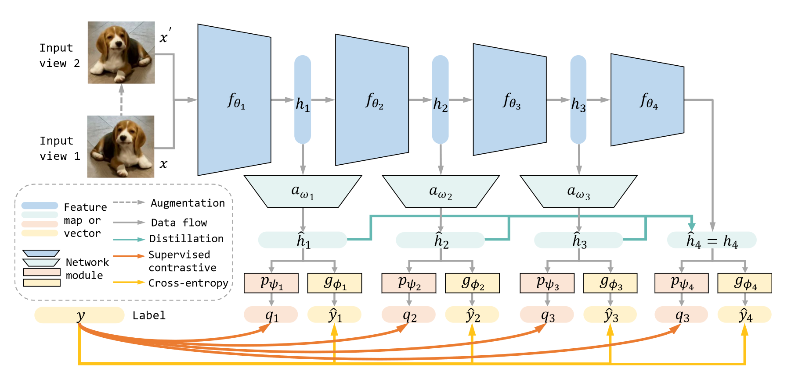

# Orchestrate Latent Expertise: Advancing Online Continual Learning with Multi-Level Supervision and Reverse Self-Distillation

## 背景

为了适应真实世界的交互，人工智能系统需要以一种在线的方式处理不断到来的内容。除去尝试解决灾难性遗忘问题的常规的终身学习（CL），在线终身学习（OCL）是一个更加有挑战性但是很现实的任务，只能通过一遍过的数据流进行学习。OCL也面临一些挑战，包括有效的在线操作、限制的输入数据和严格的资源限制。

目前OCL方法主要依靠于旧的训练样本记忆回放。但是CL和OCL在使用排练缓存时形成的过拟合-欠拟合困境上就很大的差距：由于每个训练样本只能碰见一次，因此模型对每个任务学习不够充足；但如果加入了缓存，又会不断学习旧任务，触发过拟合。

与AI系统不同，生物大脑天生具备在线终身学习的能力。具体来说，哺乳动物视觉处理系统会提取多层特征，并为以后的再使用进行记忆。在这些脑部区域的神经元不仅能够逐步处理和传输信号，还可以通过不同的神经回路与多层皮质神经元进行交流。

## 理论基础

### 问题阐述：

训练集$\mathcal{D}$被分为不同的任务，$\mathcal{D}_{t\le T} = \{(x_i, y_i)|y_i\in \mathcal{C}_t\}$，并且${\Large \cup}_{t=1}^T\mathcal{C}_t = \mathcal{C}$是标签集合。并且标签集合之间是没有交集的$\mathcal{C}_t \cap \mathcal{C}_{t'} = \empty$。终身学习部分需要任务训练集按照序列到达。由于之后的数据不可获取，因此会导致一个偏置的输入数据集，形成对旧任务的灾难性遗忘。

对于OCL，灾难性遗忘会更加严重。在训练任务$t$的阶段中，大小为$B$的序列数据批次$\mathcal{B}^t = \{(x_i, y_i)\}^B_{i=1}$从数据集$\mathcal{D}$中被无重复采集。模型只能严格对每个训练数据处理一次。因此终身学习模型对每个新任务的学习很艰难。

为了解决这个挑战，OCL方法经常使用记忆回放策略。通过使用大小为$M$的记忆缓存$\mathcal{M}$存储旧的训练样本。在每个训练迭代里，一个大小为$B^\mathcal{M}$数据批次$\mathcal{B}^\mathcal{M} = \{(x_i, y_i)\}^{B^\mathcal{M}}_{i=1}$从记忆缓存$\mathcal{M}$中取出，根据基于$\mathcal{B}^t$和$\mathcal{B}^\mathcal{M}$计算损失更新模型。

### 模型架构

一个一般的网络$F$为$\mathbb{R}^m \mapsto \mathbb{R}^{|\mathcal{C}|}$，从大小为$m$的输入$x$到分类概率向量$\hat{y}$。模型包括了一个特征提取器$f_\theta$和一个输出层$g_\phi$，参数分别为$\theta, \phi$。特征提取器包含了一系列连接的模块，将输入$x$转变为大小为$d$的特征向量。

$$\begin{aligned}
f_\theta(x) &= \left(f_{\theta_n} \circ f_{\theta_{n-1}} \circ \cdots \circ f_{\theta_1}\right) (x) \in \mathbb{R}^d, \\
\theta &= \{\theta_1, \theta_2, \cdots, \theta_n\}
\end{aligned}$$

每个模块$f_{\theta_i}$将上一层的输出特征映射$h_{i - 1}$作为输入，并生成$h_i = f_{\theta_i}(h_{i - 1})$。多层特征映射就从不同深度的模块中提取（$h_0=x, h_n=f_\theta(x)$）。一个分类器网络需要训练来最小化分类损失$\mathcal{L}(\hat{y}, y)$，其中$\hat{y} = F(x;\theta, \phi) = g_\phi(h_n) = g_\phi(f_\theta(x))$。交叉熵损失为：

$$\mathcal{L}_{ce}(\hat{y}, y) = -\sum_{c \in \mathcal{C}} y^c \log \left( \frac{\exp(\hat{y}^c)}{\sum_{s\in \mathcal{C}} \exp(\hat{y}^s)}\right )$$

其中，$\mathcal{C}$为所有标签。

### CL表示方法

$\mathcal{M}$有三个方面需要考虑：缓存大小$M$、记忆提取策略和记忆更新策略。这里有两个表示基线：

**经验回忆**（ER）：随机选取，随机更新记忆。模型$F$用交叉熵来学习增量数据批次和旧训练样本的损失函数如下：

$$\mathcal{L}_\text{ER} = \mathbb{E}_{(x_i, y_i) \in \mathcal{B}} \mathcal{L}_{ce}(F(x_i; \theta, \phi), y_i)$$

**监督对比回忆**（SCR）：通过监督对比损失，SCR会通过将相同类别相互吸引，不同类别相互排斥来学到更多的改良特征。最近类别平均分配器直接用来分类结果。在测试阶段，SCR将每个类别的平均特征和输入特征计算距离，将最近的作为预测。将线性映射层$p_\psi$替代$g_\phi$。特征$q = F(x;\theta, \psi) = p_\psi(f_\theta(x))$。

$$\begin{aligned}
\mathcal{L}_{scl}(q_i, y_i) &= - \mathbb{E}_{p \in \mathcal{P}(i)} \log \left(\frac{\exp(q_i \cdot q_p / \tau)}{\sum_{j\ne i} \exp(q_i \cdot q_j / \tau)}\right ), \\
\mathcal{L}_\text{SCR} &= \mathbb{E}_{(x_i, y_i) \in \mathcal{B}} \mathcal{L}_{scl}(F(x_i; \theta, \psi), y_i),
\end{aligned}$$

其中$\tau$是温度超参，$\mathcal{P}(i)$是$\mathcal{B}$中阳性样本的索引集合。他们的索引与$x_i$一样，但是排除$x_i$本身。

### 经验分析

重复对一个数据批次直接进行更新不是一个理想的选择，因为模型会逐渐变得偏置。

本文设计一个小实验，评估ER和SCR在不同任务数量和数据增强情况下的表现。ER在task2的效果随着epoch增加而提升，但是根据task1和整体情况来看，好像task2的提升是牺牲了task1的效果。通过加入数据增强，效果明显好很多。

同时，本文设计了一个新度量缓存过拟合指标（BOF）对缓存和测试集的泛化差距进行量化：

$$\text{BOF} = \frac{\text{Buffer accuracy} - \text{Test set accuracy}}{\text{Test set accuracy}}$$

通过实验，得出了如果不用数据增强就会欠拟合，如果使用了数据增强就会过拟合的结论，也称之为困境。

## MOSE

基于生物脑的原理，本文提出一种新颖的方法：多等级在线序列专家（MOSE）。此方法通过合并多等级监督和保留自蒸馏，将模型培养为堆叠的子专家。不同阶段的监督信号促进着对新任务的收敛，同时通过知识蒸馏让专家减轻旧任务表现的衰退。

基于上述两个模块，模型可以通过编排一个潜在任务网络技能乐谱处理任务，能抵抗分布迁移并保证任务准确率。

### 多层监督

先前的研究表明，多尺度的特征映射会提供从模式级知识到高度语义级理解的多层信息，帮助视觉任务。

首先，整个网络根据骨架被分为$n$个模块。每个特征映射$h_i$的维度不一样（$d_0 = m$，$d_n = d$）。为了统一特征大小以便于进一步的计算和比较，本文引入一个维度对齐模块$a_{\omega_i}: \mathbb{R}^{d_i} \mapsto \mathbb{R}^d$，参数为$\omega_i$，模块将所有特征映射投射到维度为$d$的特征映射，也就是$\hat{h}_i = a_{\omega_i}(h_i) \in \mathbb{R}^d$。

**潜在序列专家**：由于大小相同，那么每一个模块都可以充当为一个终身学习者。本文将$p_{\psi_i}$和$g_{\phi_i}$作为输出层，分别使用监督对比学习和交叉熵学习。之后将每一个模块-对齐-输出层作为潜在的专家$E_i$。损失函数为：

$$\begin{aligned}
\mathcal{L}_{E_i}(x, y) &= \mathcal{L}_{ce}(\hat{y}_i, y) + \mathcal{L}_{scl}(q_i, y),\\
\text{where, } \hat{y}_i &= E_i(x; \theta_{1:i},\phi) = g_{\phi_i}(a_{\omega_i}(f_{\theta_{1:i}}(x))),\\
q_i &= E_i(x; \theta_{1:i},\psi) = p_{\psi_i}(a_{\omega_i}(f_{\theta_{1:i}}(x))).
\end{aligned}$$

因此多层监督信号$\mathcal{L}_{\text{MLS}}$为所有专家的损失函数取平均。

$$\mathcal{L}_{\text{MLS}} = \mathbb{E}_{(x_i, y_i) \in \mathcal{B}} \sum_{j=1}^n \mathcal{L}_{E_j}(x_i, y_i).$$

**处理新任务的单独$\mathcal{L}_{ce}$**：最近有研究表明，输出分数梯度不平衡会导致新旧任务之间的决策边界很差。因此，本文将$\mathcal{L}_{ce} = \mathcal{L}_{ce, \text{new}} + \mathcal{L}_{ce, \text{buf}}$来避免严重梯度偏置。具体而言，基于缓存$\mathcal{M}$会在任务中和类别中展示更好的平衡性这一假设，$\mathcal{L}_{ce, \text{buf}}$一般在缓存批次$\mathcal{B}^\mathcal{M}$上进行计算。对到来的数据批次$\mathcal{B}^t$，损失函数会根据$\mathcal{C}^t$输出分数计算损失函数：

$$\mathcal{L}_{ce, \text{new}}(\hat{y}, y) = \sum_{c \in \mathcal{C}^t} y^c \log\left ( \frac{\exp(\hat{y}^c)}{\sum_{s\in \mathcal{C}^t}\exp(\hat{y}^s)}\right )$$

### 保留自提取

本文通过任务级测试对于每个专家$E_i$的准确率。本文假定理想情况下网络会对每个任务选择最佳的专家。MAX代表最高准确率，MOE代表每次多专家共同预测准确率。

前六行发现，不同任务适合的专家不一样。并且多个专家共同决策会比单一选择专家决策要好。这证明了多专家的重要性。但是MOE需要额外的计算和存储消耗，本文引用的$a_w$、$p_\psi$和$g_\phi$不够好。因此，本文打算将不同专家的技能迁移到最后一个专家$E_4$上。

因此本文使用了保留自提取（RSD）的方法，RSD将潜在序列专家作为老师、将最大的专家$F$作为学生。通过计算标准化后的$\hat{h}_i ,i<n$和标准化后的$h_n$的L2距离，使其最小化。

$$\begin{aligned}
\mathcal{L}_\text{RSD} &= \mathbb{E}_{(x_i, y_i) \in \mathcal{B}}\sum_{i=1}^{n-1}\left \| \hat{h}_i' - h_n' \right \|_2,\\
h' &= \text{normalize}(h) = h/\left \| h\right \|_2.
\end{aligned}$$

通过实验下六行的结果来看，$E_4$确实成为了最强的专家。对MOE和MAX都有提升。其次，在初次接收挑战的时候，准确率也不低。

### 整体架构

$$\mathcal{L}_\text{MOSE} = \mathcal{L}_\text{MLS} + \mathcal{L}_\text{RSD}$$

## 实验结果

MOSE在学习新样本和保留旧样本表现出非常好的效果。提升了OCL SOTA的准确率。

消除了欠拟合-过拟合困境。消融实验证明了每个模块的重要性。专家数量为4较好。

## 个人感想

这篇论文的特点不仅仅在解决问题，而在于提出问题。通过做一些前置实验和测试，找出目前模型的问题所在，这是首先要学习的。

然后多层映射、知识蒸馏这些都是前人做好的，但是如何合适的运用这篇论文也给出了依据，最后一步步推导到达了完美的结果，可见境界之高。
