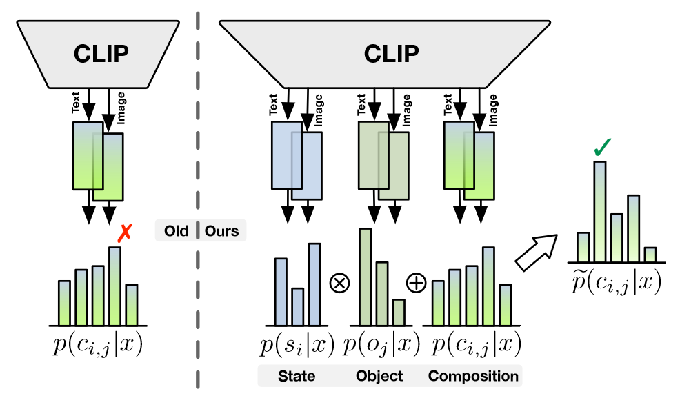
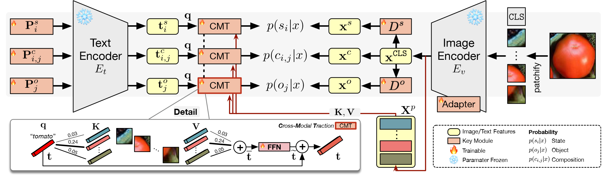

# Troika: Multi-Path Cross-Modal Traction for Compositional Zero-Shot Learning

## 背景

作为研究类人组合型泛化能力的任务，组合型零样本学习（CZSL）用于在测试阶段识别未见过的组合，而在训练时只提供见过的状态和物体。

最近，CZSL方法通过只为状态-物体配对构建可训练的prompt来适应于预训练视觉语言模型（VLM）。由于CZSL数据集在预训练只提供组合型标签（比如“红”+“酒”）而不是完整的句子，因此为了不微调整个模型就填补这个差距，就会用prompt在状态-物体标签前加入一个前缀比如“a photo of”。

先前的工作已经将固定的prompt token替换为可学习的token，在微调过程中直接优化。通过为组合设计prompt微调的方法，目前的方法可以有效在图像和组合表现之间取得一个跨模态的对齐，从而解锁VLM的潜在组合泛化能力。

然而，由于依赖于学习可见组合的联合表示，这些方法忽略了状态和物体的清晰建模，从而限制了预训练知识的运用和对未知组合的泛化。

1. 由于大量的多模态信息与组合并不相关，但会与单一原始信息有联系，因此完全利用预训练知识不可行。
2. 由于模型很容易过度依赖于局限的已知组合，对未知的组合泛化难度会加大。

## 三驱

### 前置知识

**CZSL任务构建**：给定状态集合$\mathcal{S} = \{s_1, s_2, \dots, s_{\left | \mathcal{S}\right |}\}$和物体集合$\mathcal{O} = \{o_1, o_2, \dots, o_{\left | \mathcal{O}\right |}\}$作为原始概念，其中$\left | \cdot\right |$代表集合元素的数量。组合标签的空间$\mathcal{C}$被定义为两者的笛卡尔乘积，即$\mathcal{C} = \mathcal{S} \times \mathcal{O}$。并且已知和未知的组合被定义为$\mathcal{C}^{se}$和$\mathcal{C}^{us}$，为$\mathcal{C}$的两个不相交子集。为了让模型学习使得将目标集合$\mathcal{C}^{tgt}$中的组合标签分配给输入图像，任务会提供训练集$\mathcal{T} = \{(x_i, c_i) | x \in \mathcal{X}, c \in \mathcal{C}^{se}\}$，其中$\mathcal{X}$为图像空间。在封闭世界设定下，目标集合被定义为$\mathcal{C}^{tgt} = \mathcal{C}^{se} \cup \mathcal{C}^{us}$，其中只有事先规定好的组合。而在开放世界设定，目标集合为所有可能的状态-物体组合排列，即$\mathcal{C}^{tgt}=\mathcal{C}$。

**视觉特征提取**：给定输入图像$x \in \mathbb{R}^{H \times W \times C}$，利用ViT的图像编码器$E_v$首先将图片分为$N^p = HW/P^2$个不重叠的块，其中每一块的分辨率为$(P,P)$。每个块通过投射和预训练token `[CLS]`一起形成块token序列，这里预训练位置嵌入也被加入其中来保留位置信息。接着，$E_v$利用基于自注意力的模块更新token序列$\mathbf{X}\in \mathbb{R}^{(N^p+1) \times d^{in}_v}$，其中$d^{in}_v$是每个视觉token的维度。最后，一个带有参数$\mathbf{W}_g \in \mathbb{R}^{d^{in}_v \times d}$单一线性层$g^{proj}$将序列投射到输出的`[CLS]` token，其中$d$为跨模态潜在空间的维度。投射出来的token $\mathbf{x}^{\text{CLS}} \in \mathbb{R}^d$为图像表示。

**语言部分**：目前现存的基于CLIP的方法都为推理建立了一个单一的跨模态对齐，根据给定的输入图片$x$和候选配对$c_{i,j} = \left \langle s_i, o_j \right \rangle$生成识别概率$p(c_{i,j}|x)$。由于冻结的CLIP骨干已经提供了完善的视觉语言对齐，这些方法非常重要的一步就是为组合标签构造合适的prompt。通常来说，一个新的原始词典$\mathbf{V} = \left [\mathbf{V}^\mathcal{S}, \mathbf{V}^\mathcal{O}\right ] \in \mathbb{R}^{(\left | \mathcal{S} \right | + \left | \mathcal{O} \right |) \times d^{in}_t}$包含了全部的状态和物体，其中$d^{in}_t$为每个词典token的维度。接着，自然语言前缀比如“a photo of”被转变为预训练嵌入token。与在CLIP推理中使用的占位符prompt格式不同，CZSL方法中将前缀token加入到状态-物体组合中，获得配对$c_{i,j}$的prompt $\mathbf{P}_{i,j} = \left [ \mathbf{p}_1, \dots, \mathbf{p}_m, \mathbf{v}_i^s, \mathbf{v}_i^o\right ]$，其中$\{\mathbf{p}_1, \dots, \mathbf{p}_m\}\in \mathbb{R}^{m \times d_i^{in}}$为前缀token，$\mathbf{v}_i^s$、$\mathbf{v}_j^o$为$s_i$和$o_j$的词典token。通过将$\mathbf{P}_{i,j}$喂入文本编码器$E_t$中，prompt表示$\mathbf{t}_{i,j}\in \mathbb{R}^d$被用来和图像表示$\mathbf{x}^{\text{CLS}}$通过余弦相似度来计算$p(c_{i,j}|x)$。更早一些的工作也做过其他尝试，但推理仍然只通过一条单一路径来估计组合概率。

### 多路范式

本文为CZSL模型提出一个新颖的范式**Multi-Path**，通过建立三种身份分治来联合建模状态、物体和组合。与先前的方法只依赖于组合概率不同，Multi-Path将所有语义部分的预测都进行了整合，用作最终的决策。

具体来说，在训练中三个分支可以共同以多任务学习方式优化参数。对于推理，状态和物体的预测结果可以被合并来帮助组合分支。组合的概率$\tilde{p}(c_{i,j}|x)$被定义为：

$$\tilde{p}(c_{i,j}|x) = p(c_{i,j}|x) + p(s_i|x) \cdot p(o_j|x)$$

其中，在状态和物体之间视为相互独立的时候，联合分布可被当做一个直接组合预测的偏置修正。并且最有可能的组合被定义为：

$$\hat{c} = \underset{c_{i,j}\in \mathcal{C}^{tgt}}{\text{arg max}} (\tilde{p}(c_{i,j}|x))$$

通过多线性范式，本文能削弱可见组合上的巨大偏置、促进更加稳定的识别系统。并且多线路范式适用于各种VLM。

### Troika

本文提出的**Troika**是一个出色的工具。在语言侧，Troika构建了特定的prompt，将可学习的先验知识用于描述特定目标类别的上下文。在视觉侧，引入轻量化适应的同时，Troika将原始视觉特征进行分解来实现个体识别。

**学习prompt表示**：本文为每一条分支都设置了对应的prompt前缀。对于每一个状态-物体配对$c_{i,j} = \left \langle s_i, o_j \right \rangle$，状态prompt $\mathbf{P}^s_i$、物体prompt $\mathbf{P}^o_j$和组合prompt $\mathbf{P}^c_{i,j}$可由如下进行构建：

$$\begin{aligned}
\mathbf{P}^s_i &= \left [\mathbf{p}_1^s, \dots, \mathbf{p}_m^s, \mathbf{v}_i^s\right ]\\
\mathbf{P}^o_j &= \left [\mathbf{p}_1^o, \dots, \mathbf{p}_m^o, \mathbf{v}_j^o\right ]\\
\mathbf{P}^c_{i,j} &= \left [\mathbf{p}_1^c, \dots, \mathbf{p}_m^c, \mathbf{v}_i^s, \mathbf{v}_j^o\right ]\\
\end{aligned}$$

其中$\{\mathbf{p}_1^s, \dots, \mathbf{p}_m^s\}$、$\{\mathbf{p}_1^o, \dots, \mathbf{p}_m^o\}$和$\{\mathbf{p}_1^c, \dots, \mathbf{p}_m^c\}$分别为可学习的状态前缀、物体前缀和组合前缀。这三个可训练的prompt之后喂入文本编码器$E_t$中获得每个分支的prompt表示：

$$t^s_i = E_t(\mathbf{P}^s_i), \ \ \ t^o_j = E_t(\mathbf{P}^o_j),\ \ \ t^c_{i,j} = E_t(\mathbf{P}^c_{i,j})$$

**学习视觉表示**：基于实验结果，本文通过引入Adapter来适应图像编码器，而不更新预训练的参数。本文仍然将图像表示$\mathbf{x}^{\text{CLS}}$作为组合视觉表示$\mathbf{x}^c$，本文引入状态分离器$D^s$和物体分离器$D^o$来分解出状态和物体视觉特征$\mathbf{x}^s$和$\mathbf{x}^o$：

$$\mathbf{x}^s = D^s(\mathbf{x}^{\text{CLS}}), \ \ \ \mathbf{x}^o = D^o(\mathbf{x}^{\text{CLS}}),\ \ \ \mathbf{x}^c = \mathbf{x}^{\text{CLS}}$$

其中$D^s$和$D^o$为两个独立的MLP。这个结构通过非线性映射将纠缠的全局特征分解出特定的原始特征。

**训练**：给定每个分支的提示表示和视觉特征，状态$s_i$、物体$o_j$和组合$c_{i,j}$与图片对齐的概率计算公式如下所示：

$$\begin{aligned}
p(s_i | x) &= \frac{\exp(\mathbf{x}^s \cdot \mathbf{t}^s_i / \tau)}{\sum_{k=1}^{\left | \mathcal{S} \right |}\exp(\mathbf{x}^s \cdot \mathbf{t}^s_i / \tau)}\\
p(o_j | x) &= \frac{\exp(\mathbf{x}^o \cdot \mathbf{t}^o_j / \tau)}{\sum_{k=1}^{\left | \mathcal{O} \right |}\exp(\mathbf{x}^o \cdot \mathbf{t}^o_j / \tau)}\\
p(c_{i,j} | x) &= \frac{\exp(\mathbf{x}^c \cdot \mathbf{t}^c_{i,j} / \tau)}{\sum_{k=1}^{\left | \mathcal{C}^{tgt} \right |}\exp(\mathbf{x}^c \cdot \mathbf{t}^c_k / \tau)}\\
\end{aligned}$$

其中$\tau \in \mathbb{R}$为CLIP中的预训练温度参数。在每个分支，交叉熵损失用于帮助模型显著识别对应的语义选项：

$$\begin{aligned}
\mathcal{L}^s &= -\frac{1}{\left | \mathcal{X}\right |}\sum_{x \in \mathcal{X}}\log p(s|x)\\
\mathcal{L}^o &= -\frac{1}{\left | \mathcal{X}\right |}\sum_{x \in \mathcal{X}}\log p(o|x)\\
\mathcal{L}^c &= -\frac{1}{\left | \mathcal{X}\right |}\sum_{x \in \mathcal{X}}\log p(c|x)\\
\end{aligned}$$

因此，整体训练损失$\mathcal{L}_{all}$为：

$$\mathcal{L}_{all} = \alpha^s \mathcal{L}^s + \alpha^o \mathcal{L}^o + \alpha^c \mathcal{L}^c$$

其中$\alpha^s,\alpha^o, \alpha^c \in \mathbb{R}$为超参。本文在此为了简便忽略了权重衰退。

### 跨模态牵引

尽管本文利用了VLM的跨模态理解，在与以上相似的视觉语言表示仍然会存在细微偏差。为了校准与以上相似的多模态表示的偏置，本文进一步在Troika中设计一个**跨模态牵引模块**将prompt表示移动到目前的视觉上下文。设计的初衷是，通过比对多种视觉表示，仅仅通过一个固定的prompt表示在直觉上是不能充分匹配不同领域所有对应的图片的。通过挑选并合并语义上最关联的视觉特征，该模块能将原来静态的prompt表示牵拉到视觉上下文中。

具体来说，跨模态牵引模块由$N$个block堆叠而成。在每一个block中，本文首先将prompt表示与所有图像块token之间进行了缩放点积注意力机制。本文将$\mathbf{t}$作为任意分支的prompt表示，将$\mathbf{X}^p \in \mathbb{R}^{N^p \times d}$视为经过线性层$g^{proj}$映射后的`[CLS]` token前的图像块token。之后，注意力机制的query、key和value计算如下所示：

$$\mathbf{q} = \mathbf{t}\mathbf{W}_q, \ \ \ \mathbf{K} = \mathbf{X}^p\mathbf{W}_K,\ \ \ \mathbf{V} = \mathbf{X}^p\mathbf{W}_V$$

其中，$\mathbf{W}_q, \mathbf{W}_K, \mathbf{W}_V \in \mathbb{R}^{d \times d^{attn}}$为参数矩阵，$d^{attn}$为单头注意力的维度。整个注意力过程为：

$$\bar{\mathbf{t}} = \text{Attention}(\mathbf{q}, \mathbf{K}, \mathbf{V}) = \text{softmax}\left (\frac{\mathbf{q}\mathbf{K}^\top}{\sqrt{d^{attn}}}\right )\mathbf{V}$$

在实际操作中，带有$h = d/d^{attn}$个并行注意力头的多头注意力被用于多样化表示子空间。注意力层之后，喂入一个前向传播网络FFN。

$$\tilde{\mathbf{t}} = \text{FFN}(\bar{\mathbf{t}})=\sigma(\bar{\mathbf{t}}\mathbf{W}_1+\mathbf{b}_1)\mathbf{W}_2+\mathbf{b}_2$$

其中$\mathbf{W}_1$和$\mathbf{W}_2$为参数矩阵，$\mathbf{b}_1$和$\mathbf{b}_2$为偏置，$\sigma(\cdot)$为非线性激活函数。为了简化，本文对于注意力和FFN都忽略了残差连接。之后本文如下对prompt表示进行更新：

$$\mathbf{t} \rightarrow \mathbf{t} + \mathbf{\lambda}\cdot \tilde{\mathbf{t}}$$

其中，$\mathbf{\lambda} \in \mathbb{R}^d$为控制每个维度上跨模态牵引强度的可训练参数向量。$\tilde{t}$可被视为将$\mathbf{t}$牵拉至视觉上下文的向量。在实际操作中，本文将三个分支共用相同的模块来减小参数负载。

## 实验结果

通过在三个大众的benchmark（MIT-States、UT-Zappos、C-GQA）上的大量实验，本文的方法在开放世界和封闭世界设置下显著超过了现存的方法。

度量：加入一个校准偏置，用于将可见类别和不可见类别区分开来。

$$\hat{c} = \underset{c_{i,j}\in \mathcal{C}^{tgt}}{\text{arg max}} (\tilde{p}(c_{i,j}|x) - \gamma\mathbb{I}[c_{i,j}\in \mathcal{C}^{se}])$$

其中，$\gamma \in (-\infty, +\infty)$。如果$\gamma = -\infty$，那么就只会考虑可见的类别，得到的最佳可见准确率（**S**）；如果$\gamma = +\infty$，只会考虑不可见的类别，得到最佳的不可见准确率（**U**）。**HM**为调和平均值；**AUC**为在$\gamma$变化下形成曲线的面积。

### 消融实验

1. 加入多路径范式，提升了整体的性能。
2. 无论是训练还是推理过程中删除特定分支，性能上会有下降。
3. 如果只在推理阶段删去分支，性能会普遍好于在训练阶段删去。证明了损失函数设计的有效性。
4. 前缀参数不共享的效果会更好，词典使用共享的会更好（语义关联）。
5. 带有跨模态牵引模块会显著提升效果。

---

- None：不做任何微调
- Full：所有参数都微调。
- Bias：只微调偏置项。
- Proj：只微调最后线性映射层$g^{proj}$。
- Partial：只微调encoder中的最后一个block。
- Prompt：只微调插入token序列$\mathbf{X}$的可训练prompt。
- Adapter：只微调加入到encoder的适配器。

1. 就算不做任何微调，效果还是好于现存的方法。
2. 尽管完全微调在C-GQA上表现出色，但在另外两个数据集不佳。因此完全微调可能很容易就会出现过拟合的情况，导致泛化能力差。
3. 所有的轻量化微调策略都要比不微调要好得多。
4. Adapter的综合效果出色，适合在本文模型中使用。

### 量化分析

1. 语义更加接近的会提供更多的注意力。
2. 即使预测的答案出错，Troika也能理解图片中的上下文。
3. 去除了Multi-Path，会出现词汇不匹配的情况。
4. 去除了CMT，预测的词能看出与场景不符。

## 个人感想

创新点：

- 跨模态牵引让文本的特征表示更加贴近视觉上下文。
- 三路驱动提高了状态-物体匹配程度。
- 利用Adapter、Prompt tuning实现轻量化微调。

局限性：

- 模型的局限，使用的CLIP模型决定了模型本身无法识别的到了下游任务也无法识别。
- 注意力的局限：由于注意力无先后次序，无严格意义上的“推理”，因此无法得知商店的是否开着。
- Path数量的指数型增长：如果增加答案的词汇数量，那么相应的Path也会呈非线性增多。

可拓展、借鉴的方向：

- 实验丰富，提供了强有力的支持。
- 新的benchmark：持续学习、主谓宾结构、状态-主语-谓语-状态-宾语结构、通过预先的背景和前置知识限制回答的范围。
- 改善度量，将预测和标准答案语义相似性作为指标。
- 加入新的Path补足推理：场景path、视觉信息path、图谱path，用于为三条branch的分布提供校准、或者“牵引”特征表示。
- 加入视觉推理模块。
