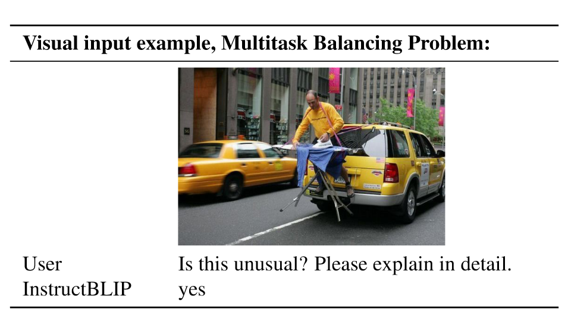
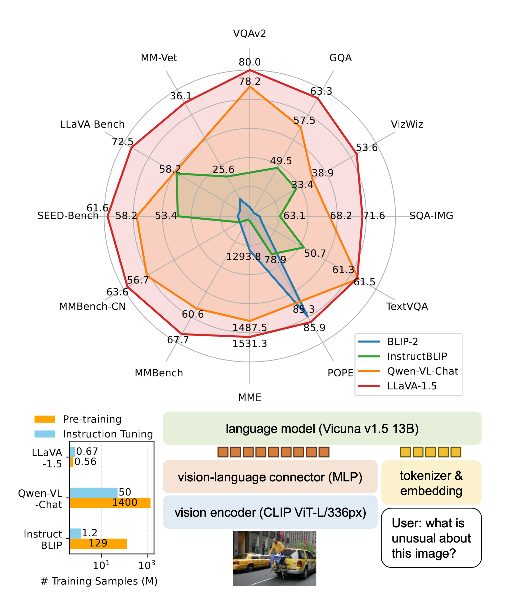

# Improved Baselines with Visual Instruction Tuning

## 背景

大多模态模型（LMM）在研究中变得越来越流行，这是搭建万能assitant的重要一步。最近，LMM通过视觉指令微调展示出了振奋人心的进展。LLaVA和MiniGPT-4在自然语言理解和视觉推理能力上展示出了强大的能力。

为了更好地理解LMM的能力，很多benchmark被提出，涉及到多模态各方面能力。最近的工作通过分别扩展预训练数据、指令跟随数据、视觉编码器、语言模型进一步提升了能力。LLaVA架构也被用于不同的下游任务和领域中，包括区域级、像素级的理解；生物医学助理、图像生成、对抗性研究等。

---

但是，尽管有很多benchmark和进展，我们仍然不知道如何为LMM挑选适合的模块和参数，来使其能力得到全方位的拓展。

LLaVA作为视觉指令微调的重大工作，在视觉推理能力中展现了值得称赞的能力，在不同的现实视觉指令服从任务上超过了众多模型。LLaVA用一个单一的线性层将视觉特征映射到语言空间上，并用视觉指令微调优化整个LLM。但是LLaVA在那些短回答的任务中表现较差，由于训练样本的不足，经常在yes/no问题中倾向于回答yes。

另一方面，InstructBLIP创新性地将VQA-v2这种面向学术任务的数据集与LLaVA-Instruct合并，在VQA任务上表现出提升的效果。他在129M图像文本对上预训练Qformer并在视觉指令微调中只微调指令级的Qformer。但是，目前的研究显示InstructBLIP在真实视觉问答任务中表现没LLaVA那么好。具体来说，它已经对VQA数据过拟合了，总是会输出短句答案，无法给出详细回答。

尽管两者在模型架构和训练数据上有很大的差距，但是两者能力的不一致的根本原因还捉摸不透。当然，我们可以有相关的推测：比如训练数据的大小、重采样的使用等。

## LLaVA-1.5

为此，本文提出第一个系统的在LLaVA框架下的LMM设计调查研究。

### 响应形式提示

本文发现对像InstructBLIP这样的方法，无法平衡短回答和长回答的VQA任务表现，原因如下：

1. 如果要同时具备短回答和长回答的能力，那么数据集就需要同时包括两种类型的问答。但是响应形式的提示词太模棱两可了。比如$Q:\{Question\} \ A:\{Answer\}$。这种提示词并不能鲜明指出需要的输出形式，导致在自然对话场景也一直输出短回答。

2. 没有微调LLM。InstructBLIP在指令微调的时候只微调了Qformer。这需要Qformer的视觉输出token来控制LLM的输出为长回答还是短回答。但是Qformer缺乏这样做的能力，因为其与LLaMA这样的大模型相比还是有能力上的局限性的。

因此，为了让LLaVA能更好地处理短回答，避免InstructBLIP的局限性，本文使用一个响应格式化的提示词来鲜明区分输出的格式。在促进短回答时，将如下句子加到问题后面：*Answer the question using a single word or phrase.*。本文发现当LLM在这种提示词下进行微调，LLaVA能够根据用户的指令调整输出的形式，并且不需要用ChatGPT对回答进行额外的处理。

根据与InstrcutBLIP的效果比较，在MME任务上，LLaVA通过上述微调方法超过了InstructBLIP 111点值。

（蓝色代表数据上的改良、红色代表模型上的改良、黄色代表分辨率的改良）

### 扩展数据与模型

**多层感知机视觉语言连接层**：受到半监督学习中通过将线性映射转变为MLP从而提升效果的思路，本文发现相比原来的线性映射，使用一个两层MLP提升视觉语言连接层表示能提升LLaVA的多模态能力。

**面向学术任务的数据**：本文进一步将面向学术任务的数据加入到VQA、OCR和区域级感知中，用来提升模型的能力。通过加入开放知识VQA和OCR任务，LLaVA的各方面能力得到加强。另外，加入区域级的VQA数据集提升了模型锁定视觉信息的能力。

（蓝色代表数据上的改良、红色代表模型上的改良、黄色代表分辨率的改良）

**额外的扩展**：本文进一步将输入的图像分辨率提升为$336^2$，将视觉编码器换为CLIP-ViT-L-336px，从而让LLM能感知到更多图片细节。另外，本文将GQA数据集作为额外的视觉知识来源。本文也加入了ShareGPT数据并将LLM的参数大小提升至13B。可以看到当模型的参数增加，MM-Vet的效果提升最大，提升了视觉交流的能力。

最后，本文将做过所有修改的模型作为LLaVA-1.5。InstructBLIP或者Qwen-VL会用特别设计过的视觉重采样在上亿图像文本对进行训练，而LLaVA只使用了LMM的最简单的架构，只需要通过一个简单的全连接映射层在6万图像文本对上进行训练。

## 实验结果

LLaVA在11个benchmark上获得了SOTA效果。本文最终的130亿参数的检查点模型只用了1.2M公开可用的数据（而不是内部数据），在一个8*A100机器上训练了差不多一天时间（6小时预训练、20消失视觉指令微调）。

- LLaVA1.5的效果在指令服从任务上比LLaVA效果都要好。
- LLaVA-1.5-HD能处理高分辨率的图像，效果在需要更多图像细节的数据集上表现更好。
- 增加全局上下文信息可以很好地引导模型锁定相关的区域。
- 视觉指令微调能有效提升LMM的能力，打破了认为LMM需要很多视觉语言对齐预训练的共识。

- 在面向学术任务的数据集上，LLaVA1.5的表现也非常好。

### 意外惊喜

**指令格式泛化**：通过调整指令格式，可以将其适用于不同的任务，比如如果信息不充足就输出“不可回答”。

**多语言能力**：由于ShareGPT中存在多语言的指令，使得LLaVA能够具备多语言多模态的能力。

### 消融实验

对于LLM的选择，本文做了消融实验。发现Vicuna-v1.5的效果是最好的。另外，LLaMA-2模型基本上比LLaMA模型要好，这说明语言模型的选择也很重要，决定了基础。在MMBench-CN这种中文数据集上，可以看到Vicuna-v1.5的泛化能力比Vicuna-v1.3强。最后，语言指令微调对于提升特定能力很重要。LLaMA-2就是因为微调的时候大多数都是英文，缺少了多语言的数据从而在MMBench-CN上效果有所下降。

### 进一步讨论

之后，本文进行了LMM中的一些开放问题的前期探索，包括如下内容：

1. 将图像输入扩大到更高的分辨率：可以看到通过提升图像的分辨率能提高模型的能力。本文展示了LLaVA对高分辨率的拓展性，只需要简单将图像分割成网格并提升数据有效性即可。另外，为了给LLM提供全局的上下文，本文额外增加了下采样的图像特征加入到特征映射中。通过提升分辨率，LLaVA的感知能力得到加强，幻觉问题减弱。将此模型视为LLaVA-1.5-HD。

    

2. 组合能力：本文发现LMM有泛化得到组合能力的可能。通过加入ShareGPT数据，模型的视觉对话能力得到加强、回答更长、细节更多。另外，通过加入短回答的数据集进行微调，促进了视觉对话的底层表现。虽然在简单VQA中能回答出物体的属性，但是并不能保证在图片的细节描述上就能说对（注意力的有限性、注意力的无序性）。涉及到外语的对话能力也较为落后。除了数据上的多样性，或许还可以再进一步研究。
3. 数据有效性：本文展示了如果随机下采样LLaVA的训练数据，使其降低为原来的75%，并不会显著下降模型的表现。数据上的混合促进了大模型的各方面能力提升。但当只有50%的数据时，模型仍然保留了超过98%的能力。另外，有些benchmark没有下降，反而增加。这说明一个精密的数据集压缩策略可以进一步提升LLaVA的有效训练。

    

4. 幻觉再思考：当输入的图像分辨率提升时，通过在训练集中加入少量的幻觉样本，幻觉现象得到明显的下降。但是如果分辨率不高，给到的视觉信息很少的情况下，模型反而会促进幻觉现象。之后的工作可以从为数据增加更多信息、模型如何正确处理粗粒度数据入手。

## 个人感想

缺点：

- 面对不同的任务需要适当调整。虽然灵活，可以加入各种组件完善性能，但是面向现实环境不能直接使用。
- 分辨率不够灵活，mPLUG-Owl2更好。
- 多跳图片不能处理。

特色：

- 在已有研究的基础上进一步探索，永远比别人快一步。
- 研究地很系统，涉及到大模型的方方面面，为很多方向提供一些线索。
