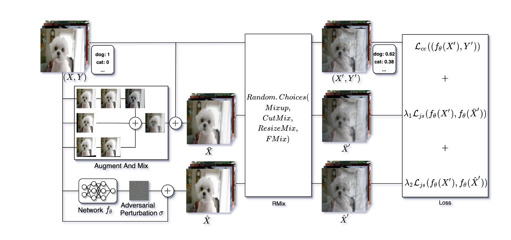

# AUGRMIXAT: A DATA PROCESSING AND TRAINING METHOD FOR IMPROVING MULTIPLE ROBUSTNESS AND GENERALIZATION PERFORMANCE

## 背景

深度神经网络效果强大，但是他们对噪声之类的对抗性信息比较敏感。而保持神经网络的稳定性和可靠性是将其应用在安全领域的重中之重。

**图像增强**是指将图像进行反转、变换、变色、裁剪、旋转等操作，来增强模型的泛化能力。

## AugRmixAT

首先，通过图像增强和混合，得到图像$\bar{X}$。之后，通过给图像进行扰动，得到图像$\hat{X}$。之后在许多Augment and Mix方法中进行选择，对$X, \bar{X}, \hat{X}$进行处理。

## 实验

实验证明，结果比较有效。

## 个人感想

感觉是把之前方法进行了一个整合，可以借鉴其并行训练，损失求和的思路。
