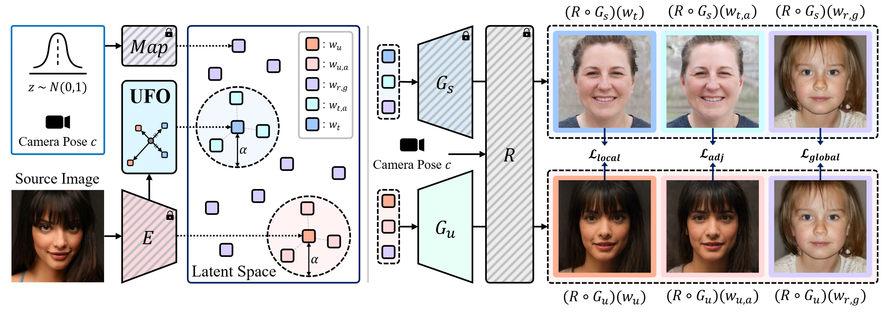

# Generative Unlearning for Any Identity

## 背景

最近，2D或3D生成对抗网络（GAN）在大数据集（FFHQ、AFHQ）上进行预训练获得了显著的生成表现和高度相异的表示空间，引起了学术界极大的关注。但是这些模型取得的进步也引起了隐私问题的焦虑，尤其是考虑到通过生成式模型来表示和使用个人实体的误用潜在问题。

为了在生成式模型中减轻隐私问题，目前机器反学习任务正在积极研究中。机器反学习涉及到选择性移除特定的知识或消除预训练模型所用的数据集中特定数据的影响。这在数据为有害、隐私或偏置的情况下是很有用的。尽管在大多数机器反学习研究中关注了许许多多的任务，但很少的研究会投身于生成式模型中，尝试消除高层概念比如呈现出版权风险的不合适的内容或艺术风格。

尽管如此，生成式模型仍然呈现出隐私问题。就算一个人的实体并没有在生成式模型的预训练中被使用，这个实体仍然会通过GAN的逆向模型轻松重建出来。另外，可以轻松通过图像编辑方法对重构的图像进行操作和编辑。为了阻止实体的潜在使用，从预训练生成模型中去除特定实体是很有必要的。

## 生成式实体反学习

### 问题构建

考虑到隐私问题，本文提出一个重要但是仍在探索的任务——生成式实体反学习，目的是促使模型不去生成特定实体的图片。与典型的机器反学习任务关注于反学习训练样本不同，本文的生成式实体反学习任务将反学习预训练GAN中的任何实体，即使其在预训练中没有被展示出来。

在生成式实体反学习中，本文确定了如下目标：

1. 阻止生成的图像带有特定实体；
2. 保留生成模型的整体质量。

---

给定描述一个特定实体一组图像$\mathbf{x}$，本文从中随机选择一个单一源图像$x_u \in \mathbf{x}$作为实体的典型。起初，使用现成的逆向网络$E$（比如EG3D）作为无条件的生成器，将$x_u$嵌入到EG3D的潜在空间里的源潜在编码$w_u$中。

$$w_u = E(x_u)$$

由于EG3D包含了映射网络$Map(\cdot)$，StyleGAN2骨干网络$G(\cdot)$和带有超高分辨率模块的神经渲染器$R(\cdot)$，本文可以将根据$w_u$重构的图像$\hat{x}$表示为：

$$\hat{x} = R(G(w_u);c)$$

其中$c$代表摄像机的方位。为了简化问题，本文将忽略摄像机方位的符号，将公式转为$\hat{x} = (R \circ G)(w_u)$。本文目标是在固定$Map$和$R$的前提下，从预训练的EG3D生成器$G_s$中获得一个反学习生成器$G_u$。通过合适的反学习，反学习后的EG3D使用$w_u$来生成图像，即$\hat{x_u} = (R \circ G_u)(w_u)$。生成的图像应该与原来的EG3D生成的图像$(R \circ G_s)(w_u)$有很大不同。

在本文的任务公式中，两个考虑是必要的。第一，本文旨在仅仅通过一张单一的图像来消除整个实体。为了评估这一任务，本文讲其他多张图片$x_0 \in \mathbf{x}$作为测试，得到对应的潜在编码$w_o = E(x_o)$。通过使用$x_o$，本文可以验证$G_u$是否已经成功对实体整体进行了反学习，而不是仅仅反学习特定的图片$x_u$。第二，本文想尝试保持预训练模型的生成性能。未来评估这一点，本文用非学习和预训练生成器从固定潜在编码中采样多张图片。之后本文评估非学习前后图片分布的偏移。

### 潜在空间反检测脸部（UFO）

为了实现生成式实体反学习，本文提出了名为适用于任何实体的生成式反学习（GUIDE）这一新颖框架。GUIDE将源实体替换为一个匿名目标实体，有效清除了原来的实体。

对于成功非学习的模型，即使$w_u$被用于潜在编码也不能生成带有实体$\mathbf{x}$的图片。随后，本文方法就是通过反学习$G$，操控$\hat{x}_u$成为其他图片而不是带有实体$\mathbf{x}$的图片。本文首先需要分配反学习的目标函数，涉及到定义从$w_t$中得到目标图像$\hat{x}_t$和从$w_u$中得到的反学习图像$\hat{x}_u$。尽管$\hat{x}_t$有很多不同的设定选项（比如随机脸部、非人脸部等），本文将$Map$的平均潜在$\bar{w}$生成的平均脸部作为$\hat{x}_t$，即$(R \circ G_s)(\bar{w})$。这一设定受到逆向方法的启发，在逆向阶段将实体应用到平均脸部上。既然本文的目标是反识别图片，本文认为将图片退回为平均脸部是比较合理且符合直觉的。

但是，这个简单的方法会在$w_u$与$\bar{w}$相近的时候出现问题，导致反学习的图像仍然与原来的实体相像。为了解决这个问题，本文提出了潜在空间反检测脸部（UFO）这一新颖的方法，能够稳定设置$\hat{x}_t$，不管$w_u$和$\bar{w}$之间的距离。

UFO的过程如下：

1. 在反识别阶段，本文通过从$w_u$中减去$\bar{w}$来提取实体潜在，即$w_{id} = w_u - \bar{w}$。

2. 之后，本文提出一个识别阶段，将目标设定在现存$w_id$的反方向上，形成一个更加明显的实体改变，从而创造出洗个完全新的实体。换句话说，本文将$\bar{w}$作为一个借力点，通过$w_u$和$\bar{w}$构建出最终的目标点。最终目标点的计算如下所示：

$$w_t = \bar{w} - d \cdot \frac{w_{id}}{\left \| w_{id}\right \|_2}$$

其中，$d$为保留源分布实体的程度，由人为经验确定。最终，通过$\hat{x}_t = (R \circ G_s)(w_t)$，本文为生成式反学习挑选出了合适的目标潜在编码。

### 潜在目标反学习

给定源和目标潜在编码，本文会更新生成器实现从源实体到目标实体的转移。本文既需要考虑$\hat{x}_u$和$\hat{x}_t$相似，又得保留$G_u$的生成性能。本文将此过程称为潜在目标反学习。

为实现这一过程，本文提出了三个新颖的损失函数——本地反学习损失、邻接级反学习损失和全局保留损失。

**本地反学习损失**负责引领本文的模型直接将源实体转移至目标实体。损失函数中使用了一些常用的重构损失函数，包括欧几里得损失$\mathcal{L}_2$、感知损失$\mathcal{L}_{per}$和实体损失$\mathcal{L}_{id}$。通过使用$\mathcal{L}_{recon}$，本文比较了从源、目标潜在编码中分别得到的三平面特征$F_u = G_u(w_u)$和$F_t = G_s(w_t)$。整体本地反学习损失被定义为：

$$\begin{aligned}
\mathcal{L}_{local}(\hat{x}_u, \hat{x}_t) &= \lambda_{L2}\mathcal{L}_{L2}(F_u, F_t) \\
&+\lambda_{per}\mathcal{L}_{per}(\hat{x}_u, \hat{x}_t) + \lambda_{id}\mathcal{L}_{id}(\hat{x}_u, \hat{x}_t)
\end{aligned}$$

---

上述等式只考虑了一个源、目标潜在编码配对。但是对源实体加入边缘扰动就能获得相似实体的图片。**邻接反学习损失**利用其他与源、目标潜在编码邻接的潜在编码从单一图片中有效反学习整个实体。本文对$w_u$的邻接点中采样了$N_a$个潜在编码。具体来说，本文利用带有超参$\alpha_{max}$形成的正态分布$\alpha^i \sim \mathcal{U}(0, \alpha_max)$采样出规模$\alpha^i$，将计算邻接潜在编码的距离$\Delta$定义为：

$$\Delta = \{\alpha^i \cdot \frac{w^i_{r,a} - w_u}{\left \| w^i_{r,a} - w_u\right \|_2} \}^{N_a}_{i=1}$$

其中，$w^i_{r,a}$为从随机噪声$z^i_{r, a}$中采样得到的一个潜在编码。通过使用这些距离$\Delta$，本文可以为源潜在编码和目标潜在编码计算邻接潜在编码。与本地反学习损失相似，本文想让从$w^i_{u,a} = w_u + \Delta^i$和$w^i_{t,a} = w_t + \Delta^i$中生成的三平面特征和图像相似：

$$\begin{aligned}
&\hat{x}^i_{u, a} = R(F^i_{u, a}), \hat{x}^i_{t, a} = R(F^i_{t, a})\\
&\mathcal{L}_{adj}(w_u, w_t) = \frac{1}{N_a}\sum_{i=1}^{N_a}\mathcal{L}_{local}(\hat{x}^i_{u,a}, \hat{x}^i_{t,a})
\end{aligned}$$

其中，$F^i_{u,a}$和$F^i_{t,a}$分别为$w^i_{u,a}$和$w^i_{t,a}$经过骨干网络后的三平面特征。

---

为了最小化反学习过程的副作用，**全局保留损失**额外标准化生成器来为与源、目标潜在编码相去甚远的潜在编码保留生成性能。具体来说，本文从随机噪声向量$\{z^i_{r,g}\}^{N_g}_{i=1}$中采样了$N_g$个潜在编码$\{w^i_{r,g}\}^{N_g}_{i=1}$。本文保证这些潜在编码不会与邻接级反学习损失中的邻接潜在编码重合。与反学习损失方程多个函数结合不同，本文发现只采用$\mathcal{L}_{per}$会在实体变换和模型保留中取得平衡。全局保留损失的计算公式如下所示：

$$\begin{aligned}
\hat{x}^i_{u,g} &= (R \circ G_u)(w^i_{r,g})\\
\hat{x}^i_{s,g} &= (R \circ G_s)(w^i_{s,g})\\
\mathcal{L}_{global}(G_u, G_s) &= \frac{1}{N_g}\sum^{N_g}_{i=1}\mathcal{L}_{per}(\hat{x}^i_{u,g}, \hat{x}^i_{s,g})
\end{aligned}$$

最终，本文的目标损失函数为：

$$\mathcal{L}_{total} = \mathcal{L}_{local} + \lambda_{adj}\mathcal{L}_{adj} + \lambda_{global}\mathcal{L}_{global}$$

## 实验结果

Baseline：只将平均编码作为目标潜在编码；采用$\mathcal{L}_{local}$作为损失函数。

大量的实验证明，本文的方法在生成式机器反学习中取得了SOTA效果。

（对于同一个实体的消除,GUIDE的清除效果更好）

（对于其他实体的保留，GUIDE没有明显不符的特征）

- Random：从随机采样的噪声向量中设定一个反学习目标图像。
- InD：从FFHQ中采样出一张图片用作预训练。
- OOD：从CelebAHQ中随机采样反学习目标图像。

---

- ID：用脸部识别网络CuricularFace计算生成同一个潜在编码在反学习前后的图片相似度。
- $\text{ID}_{\text{others}}$来评估在训练中没见过的图片但是对应的实体在源图像中的清除效果。
- FID：用于评估模型是否保留了整体的生成性能。

### 消融实验

## 个人感想

创新点：

- 提出新的任务，立意很不错。
- 反向编码确定目标 + 三层损失函数保障性能。

可拓展、借鉴的方向：

1. 提出新的任务，比如持续反学习、场景生成、文本生成等。
2. 加入新度量，取得反学习效果和性能保持的平衡。
3. 猜测：所有实体反学习后生成的实体都具有相似的特征，是否说明原数据集上缺少包含这类的数据。之后通过加入反学习后的这部分实体，能否有新的发现？
4. 图片美观，可以学习一下。
