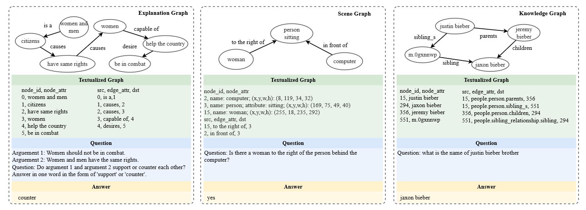
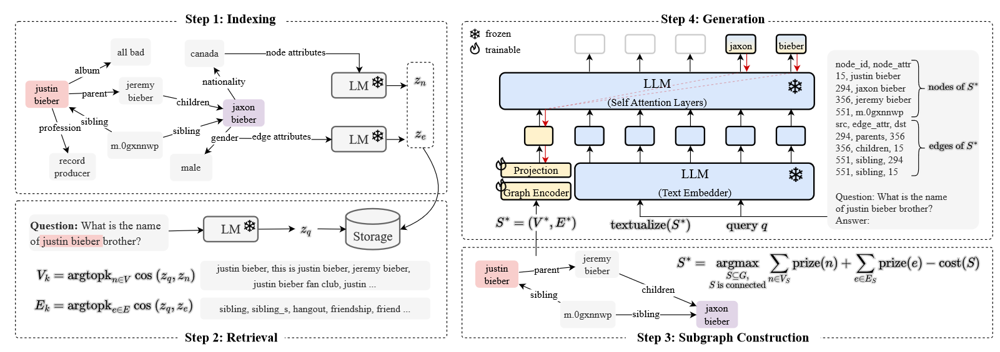

# G-Retriever: Retrieval-Augmented Generation for Textual Graph Understanding and Question Answering

## 背景

**图+LLM**：LLM的到来极大程度改变了人工智能的格局。由于被用于越来越多不同的任务，LLM需要具备处理复杂结构化的数据。尤其在目前这个相互联系的世界，真实世界数据往往以图谱的方式呈现，比如互联网、电商、推荐系统、知识图谱和其他数据。另外，许多数据涉及到带有文本属性的图谱，适合于以LLM为中心的方法。这促进了将基于图谱的方法（比如GNN）和LLM相结合促进图谱上的推理。

**赋能图谱聊天**：目前的方法以多种方式将GNN与LLM进行结合，大多关注于类似结点、边和图谱分类的传统图谱任务，或者根据小/合成的图谱回答简单问题。但是目前还没有面向真实世界、具备强大推理能力的方法。

**图谱问答任务难度需要提升**：问答是一个在自然语言处理中非常重要的任务，是评估LLM的一个关键benchmark、为不同的能力提供一个统一的接口。尽管在QA方面有广泛的研究，专门关注于图谱模态的研究还是挺少的。目前的benchmark关注于基本的基于图谱的推理任务，比如结点度数、边是否存在、最短路，与复杂、真实世界图谱涉及到的常识推理、场景理解和知识图谱推理距离还很远。

## 与图谱聊天

本文设置了一个面向真实世界文本图谱的问答框架，能处理场景图谱理解、常识推理和知识图谱推理，赋能图谱聊天。

### 前置知识

**文本图谱**：文本图谱是结点和边都具备文本属性的图谱，可被定义为$G=(V, E, \{x_n\}_{n \in V}, \{x_e\}_{e \in E})$，其中$V$和$E$分别代表了结点和边。另外，$x_n \in D^{L_n}$和$x_e \in D^{L_e}$表示着与结点$n \in V$或者边$e \in E$相联系的序列文本，其中$D$代表着字典，$L_n$和$L_e$表示对应序列文本的长度。

**文本编码的语言模型**：在文本图谱的场景下，语言模型（LM）对与结点和边关联的文本编码至关重要。因此语言模型需要通过学习表示来捕捉语义含义。对于带有文本属性$x_n \in D^{L_n}$的结点$n$，语言模型将这些属性编码为：

$$z_n = \text{LM}(x_n) \in \mathbb{R}^d$$

其中，$z_n$是LM的输出、$d$是输出向量的维度。

**大预言模型与提示微调**：LLM为任务适配引入了一个新范式：“预训练，提示词，预测”，将微调换为了提示微调。在这个范式中，LLM会首先在巨大的语料库中学习一般的语言表示。之后，不用特定任务的数据微调模型，只讲制作一个上下文和任务的文本提示词。随后，模型直接基于提示词和输入生成输出。

配备权重$\theta$的LLM，将token序列$X$和提示词$P$作为输入，生成token序列$Y = \{y_1, y_2, \cdots, y_r\}$作为输出。具体来说，给定输入序列和提示词$[P; X]$，输出序列的概率分布被定义为：

$$p_\theta(Y | [P; X]) = \prod_{i=1}^r p_\theta (y_i | y_{<i}, [P; X])$$

其中，$y_{<i}$代表着序列$y$的前序（一直到$i-1$的位置），$p(y_i | y_{<i}, [P; X])$表示给定$y_{<i}$和$[P; X]$后生成的概率。

软提示微调没有人为提示设计那么麻烦。给定一个$p$个token的序列$X = \{x_1, x_2, \dots, x_p\}$，经过文本嵌入后，形成了矩阵$X_e \in \mathbb{R}^{p \times d_l}$，其中$d_l$是嵌入空间的维度。软提示可被视作参数$P_e \in \mathbb{R}^{q \times d_l}$，其中$q$是提示的长度。两者进行合并，形成单一矩阵$[P_e; X_e] \in \mathbb{R}^{(q + p) \times d_l}$。这个矩阵通常在LLM中会进行自注意力处理。在训练中，通过反向传播会最大化$Y$的似然，梯度的更新仅仅影响到$P_e$，而参数$\theta$保持不变。

### GraphQA

本文首先通过不同任务中收集到的数据开发了图谱问答（GraphQA）benchmark。可被用于评估模型回答关于各类图的问题的能力。

**文本图谱**：文本图谱被转化成了自然语言的形式，形成结点和边的列表，和CSV文件格式类似。需要注意的是，虽然将图谱文本化有很多种方式，本文并没有寻求探索最优解。本文只是以简单粗暴的方式用自然语言的形式来表示图谱，促进GraphQA在多场景下的应用。

**问与答**：问题一般是侧重于图谱中特定元素和关系的。答案就在结点和边的属性中，经常需要多跳推理才能准确回答。

**详细信息**：GraphQA合并了三个现存的数据集，分别为ExplaGraphs、SceneGraphs和WebQSP。这些数据集不是本文制作的，但本文的贡献在于标准化、统一化这些数据集。

ExplaGraphs是用于生成式常识推理的数据集，侧重于在争论中为立场预测生成解释性图谱。它提供了精细化、确定化的尝试增强图谱来支撑或否定一个论据。主要任务就是利用准确率评估论据是可支撑的还是相违背的。本文将三元组形式的数据集转化为了标准图谱格式。

SceneGraphs是一个包括了10万场景图谱的视觉问答数据集。每张图谱会说明图像中的具体物体、属性、关系。这个数据集需要空间理解和多阶段推理能力。主要任务就是基于一个场景图谱的文本描述回答开放问题（准确率作为评价标准）。本文从GQA数据集中进行了采样，并根据JSON文件构建出了标准图谱格式。

WebQSP是一个大规模多跳知识图谱问答数据集，包含了4737个问题。通过使用Freebase的子集，围绕问题中提及的双跳实体构建了图谱。任务涉及到多跳推理。给定相同问题的多种答案概率，通过使用hit@1度量来评估精确度。

### G-Retriever

之后，为了促进有效且高效的图谱问答，本文提出了G-Retriever方法，综合使用GNN、LLM、RAG的优势，这是首个对一般文本图谱进行的提取增强生成（RAG）方法，通过软提示来增强图谱理解的能力。为了避免幻觉现象同时解决图谱长度超过LLM上下文限制的情况，G-Retriever通过将任务视为奖励收集斯坦纳树优化问题，对图谱进行RAG操作。

G-Retriever包括了四个主要步骤：索引、提取、子图构建和生成。

**索引**：本文通过使用一个预训练的LM生成结点和图嵌入，从而初始化RAG。嵌入被存储进一个最近邻数据结构中。

为了详细说明，本文将$x_n \in D^{L_n}$视为结点$n$的文本属性。利用预训练LM（这里是SentenceBert），本文获得了对应的表示。

$$z_n = LM(x_n) \in \mathbb{R}^d$$

其中，$d$代表输出向量的维度。对于边也是同样的道理。

**提取**：本文对请求$x_q$使用相同的编码策略来保证文本信息的一致对待。

$$z_q = \text{LM}(x_q) \in \mathbb{R}^d$$

之后，为了识别出目前请求最相关的结点和边，本文使用一个k近邻提取方法。这个方法会基于请求和每个结点、边的相似性得到相关集合。提取操作被定义为：

$$\begin{aligned}
V_k &= \text{argtopk}_{n \in V} \cos(z_q, z_n)\\
E_k &= \text{argtopk}_{e \in E}\cos(z_q, z_e)
\end{aligned}$$

其中，$z_n$和$z_e$分别是结点$n$和边$e$的嵌入。本文使用余弦相似度函数$cos(\cdot, \cdot)$来衡量请求和结点、边之间的相似度。

**构建子图**：目标为构建出包含尽可能多相关的结点/边的子图，同时也需要保证图谱的大小是可处理的。这个步骤有两个好处：

1. 能过滤掉对请求不相关的结点和边。不重要的信息可能会干扰有用的数据，对后续LLM的关注点造成影响。
2. 提高效率。通过缩减图谱的大小，将图谱翻译为自然语言会变得容易，这样LLM也能处理。

奖励收集斯坦纳树（PCST）问题是想找到一个相互关联的图谱，满足结点奖励值最大化和边代价最小化。本文会将更高的奖励值分给上面根据余弦相似度确定的更加相关的结点和边。具体来说，前$k$个结点/边会被分配从$k$到$1$递减的奖励值，其他的结点/边的奖励值则为零。其中结点的奖励值分配公式如下：

$$\text{prize}(n) = \begin{cases}
 k-i, & \text{ if } n \in V_k \text{ and } n \text{ is the top } i \text{ node},\\
 0, & \text{ otherwise }.
\end{cases}$$

边的奖励值分配也是同样的。这个阶段的目标是识别出一个子图，$S^* = (V^*, E^*)$，将结点和边的奖励值最大化，同时最小化子图的大小代价。

$$S^* = \argmax_{\substack{S\subseteq G,\\ S \text{ is connected }}} \sum_{n \in V_S} \text{prize}(n) + \sum_{e \in E_S} \text{prize}(e) - \text{cost}(S)$$

其中，代价计算函数为：

$$\text{cost}(S) = \left | E_S\right | \times C_e$$

$C_e$为事先确定的每条边的代价，这能用来控制子图的大小。

原来的PCST算法只是设计了结点的奖励值。但是，考虑到边在某些场景下的语义重要性，本文也加入了边的奖励值：考虑到带有代价$C_e$和奖励$P_e$的边$e$。如果$C_e > P_e$，那么$e$就被视为代价为$C_e - P_e$的被删减的边；如果$P_e > C_e$，$e$就被视为可被采纳但是代价为$P_e - C_e$的边。本文采用了一个接近$\mathcal{O}(1)$复杂度的方法来优化算法。

**答案生成**：首先，令$S^* = (V^*, E^*)$作为提取出的子图。本文使用一个图谱编码去来构建图谱的结构。具体来说，本文使用的是标准图注意力网络（GAT）。编码的公式如下：

$$h_g = \text{POOL}(\text{GNN}_{\phi_1}(S^*)) \in \mathbb{R}^{d_g}$$

其中，$\text{POOL}$为平均池化操作、$d_g$为图谱编码器的维度。之后，本文使用一个多层感知机（MLP）将图谱的token与LLM的向量空间对齐：

$$\hat{h}_g = \text{MLP}_{\phi_2}(h_g) \in \mathbb{R}^{d_l}$$

其中，$d_l$是LLM隐藏嵌入的维度。为了利用LLM的文本推理能力，本文将提取的子图$S^*$转化为文本格式。本文将这个操作定义为$\text{textualize}(\cdot)$。之后本文将文本化的图谱和请求合并来生成回答。令$x_q$为请求，本文将其与文本化的图谱$\text{textualize}(S^*)$合并。之后，通过利用一个文本嵌入（预训练冻结LLM的第一层）将回答映射到嵌入$h_t$上。

$$h_t = \text{TextEmbedder}([\text{textualize}(S^*); x_q]) \in \mathbb{R}^{L \times d_l}$$

其中$[;]$为合并操作，$L$为token的数量。最后的阶段就是给定$\hat{h}_g$这个软提示和文本嵌入输出$h_t$生成答案$Y$。这些输入将喂入预训练冻结LLM的自注意力层中，参数为$\theta$。生成的公式为：

$$p_{\theta, \phi_1, \phi_2}(Y|S^*, x_q) = \prod_{i=1}^r p_{\theta, \phi_1, \phi_2}(y_i|y_{<i}, [\hat{h}_g; h_t])$$

其中，$[\hat{h}_g; h_t]$为图谱token $\hat{h}_g$和文本嵌入输出$h_t$的合并。由于$\theta$是冻结的，因此$\hat{h}_g$来接收梯度，更新参数$\phi_1, \phi_2$。

## 实验结果

**图谱LLM中的幻觉现象**：为了调查图谱LLM中的幻觉现象，本文验证了其在图谱场景下是否会出现。具体来说，本文将MiniGPT-4适应于图谱，构建一个baseline方法，其中GNN是可训练的，将图谱数据进行编码作为LLM的软提示，LLM是冻结的。通过实验，本文发现在图谱LLM中幻觉现象也很常见。这主要是因为baseline不具备从一个单一的图谱嵌入中学习整个图谱结构的能力，从而在问答任务中生成了错误的结点或边。相反，通过将RAG引用于直接信息提取上，本文的G-Retriever减轻了这一问题。

**提升图谱LLM的可拓展性和有效性**：目前很多工作致力于将图谱翻译为自然语言，比如将结点和边合并为一个文本序列，使LLM能够处理图谱任务。但是，这种方法不具备可拓展性，如果将包含上千个结点和边的图转化为文本序列会导致庞大的token数量，这不是大多数LLM能接受的。但如果简单的截取文本长度会导致信息和回答质量的损失。G-Retriever的优势在于，选择性地将图谱相关部分进行提取。

消融实验：

## 个人感想

可借鉴之处：

- 模型训练好之后可以直接拿来用。
- 对比实验：GQA现成的场景图谱和我生成的图谱哪个更好。
- 可以尝试在benchmark的基础上做一个多优先级搜索策略。
- 软提示的方法学到了，可以尝试学习一下。
