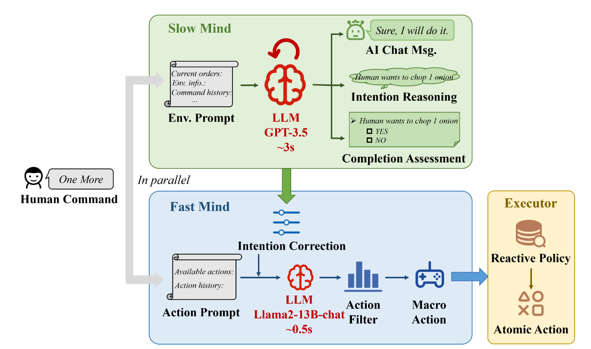

# LLM-Powered Hierarchical Language Agent for Real-time Human-AI Coordination

## 背景

LLM助力的人工智能助手已经取得了很重要的进展，它们能够在各种复杂的任务中帮助人们并促进人类-AI协同的革命。当然，这种人工助手需要大模型的API和人工设计的复杂prompt，这会导致很高的推理延迟。这不适合高度实时交互的应用，比如说游戏。

## HLA

本文考虑将游戏“分手厨房”作为实验平台，游戏中玩家可以用自然语言交流，并合作来处理订单。玩家的操作频率约为3Hz，用户会给出一些指令，有时候还是需要依靠上下文的，这时候就得需要LLM助手捕捉用户的意图并执行动作。

整个“分手厨房”实验平台如下所示，包括烹饪的流程和设计的地图。

下面是一些挑战：

- 实时交互。
- 要求的推理：包括具体量化、隐含的意思和模糊指向。

本文提出一个分层语言助手（HLA），可以保证强大的推理能力和实时的执行。具体来说，HLA会采用一个分层的框架，包含一个专家LLM（慢脑）用来进行意图推理和语言交互、一个轻量LLM（快脑）用来生成微动作、一个反应原则（执行者）用来将为动作转化为原子动作。

慢脑分为两个步骤，第一阶段为意图推理阶段，用于根据历史信息推理出意图（prompt工程）；第二阶段为聊天&评估阶段，用于检查命令完整性并生成回复。

通过异步执行，快脑和慢脑同时进行推理，快脑的prompt采用附加prompt机制，会一边执行任务一边接受快脑给的信息，一边更新prompt。

对于微行动的生成，本文使用一个行动过滤器来过滤掉次优微行动。过滤公式如下：

$$\log U(a|s) \propto \log P_{LLM}(a|s) + \alpha V(a|s)$$

其中，$U(a|s)$代表在目前状态$s$下，选择微行动$a$的概率；$P_{LLM}(a|s)$代表大模型输出微行动$a$的概率；$V(a|s)$代表采用微行动$a$会产生的任务奖励（硬编码）。$\alpha$会根据指令要求是否符合而发生调整。本文利用贪心策略，会选择$\log U(a|s)$最高的微行动。

- 微行动：即为动宾结构，比如切洋葱。
- 原子行动：路径规划、合适的移动。

## 实验结果

HLA超过了其他基线助手，表现出强大的合作能力，快速的响应和持续的语言沟通能力。

延迟低、分数高、面对各种含义的指令表现都很好。
