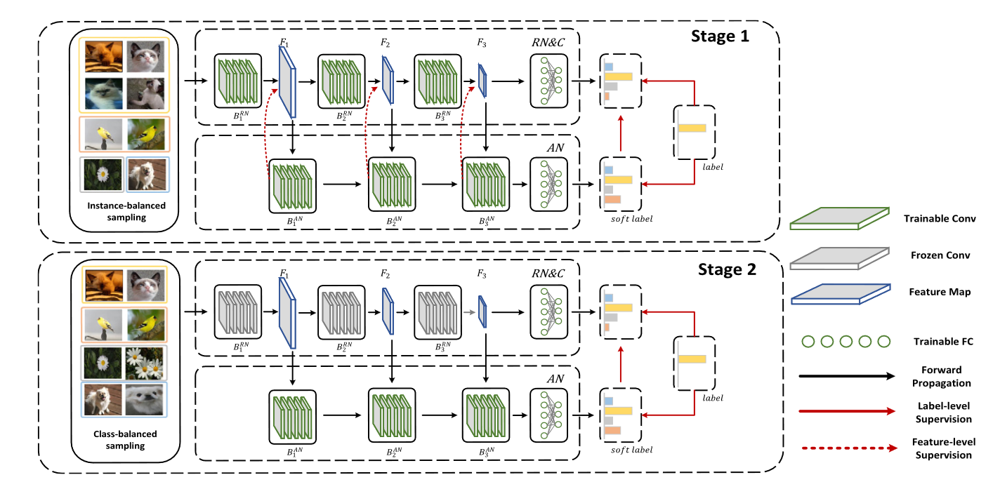
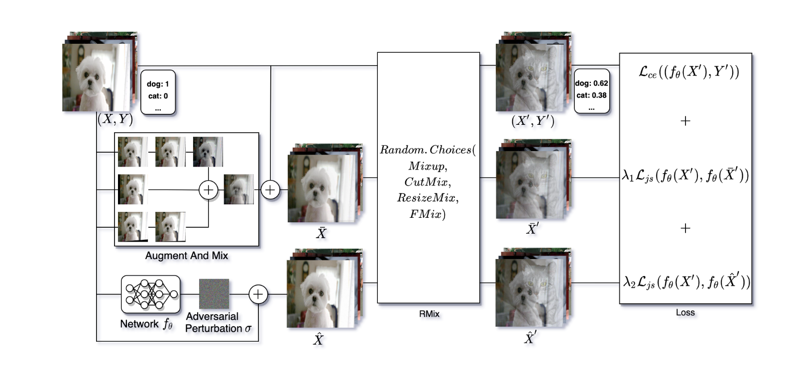

# One Paper Challenge

This is a challenge for me. To confirm the specific study domain that I am interested in, I need to read enough papers. In the mean while, I hope my paper notes can help you to learn relevent studies, although they basically are Chinese.

Here are some model structures:

|Model|Structure|
|---|---|
|DaSL (Dynamic Auxiliary Soft Labels)||
|$\text{TR}^2$||
|Single-Stage Grasp (SSG)||
|AugRmixAT||
|deep Modular Co-Attention Network (MCAN)||
|Generative Bias (GenB)||
|Visual Programming (visprog)||
|ViperGPT||
