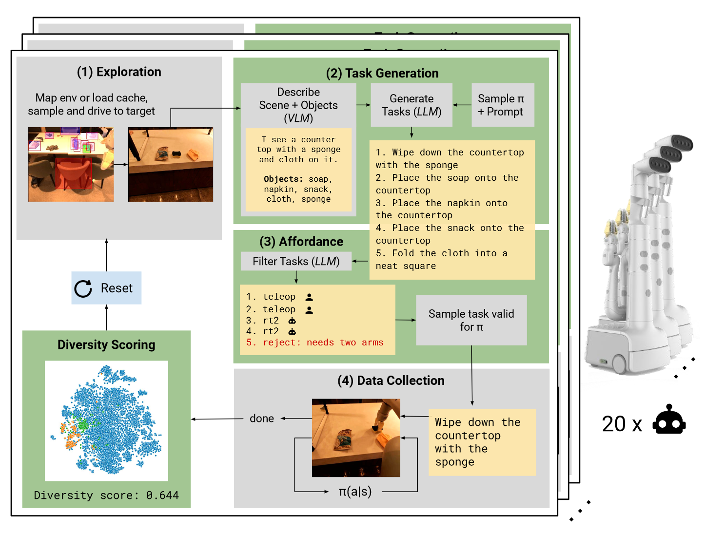

# AutoRT: Embodied Foundation Models for Large Scale Orchestration of Robotic Agents

## 背景

将语言、视觉和目前行为整合到一起的基础模型利用网络规模数据提升了对真实任务的推理能力。然而，训练具身基础模型的关键挑战之一为缺乏真实世界中的数据作为支撑。本文介绍了AutoRT，一个利用基础模型，通过最小人类监督提升可操作机器人在完全未见的场景的部署。AutoRT利用视觉语言模型（VLM）进行场景理解和关联，另外进一步使用大语言模型LLM生成一梯队机器人需要执行的多样且新颖的指令。通过挖掘基础模型的知识来引导数据收集，AutoRT能有效对自动权衡和安全进行推理，同时为机器人学习显著提升数据收集的规模。

在高层，AutoRT通过开放词典对象检测器收集数据来初步理解并描述场景。之后在给定高层目标的情况下，LLM将解析这段描述，并生成可感知、安全的语言目标。之后由LLM来决定如何执行这些目标。
