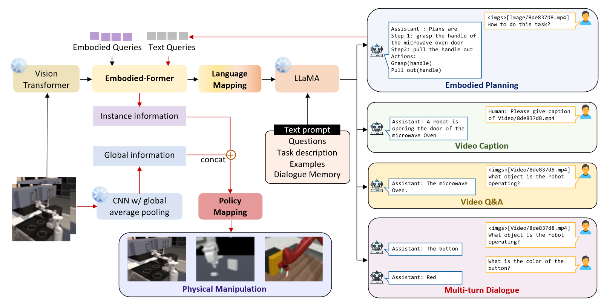

# EmbodiedGPT: Vision-Language Pre-Training via Embodied Chain of Thought

## 背景

具身智能是机器人学中的重要前沿，能够为机器人规划并执行任务序列来完成真实环境中的复杂任务。本文提出了EmbodiedGPT，一个面向具身智能的端到端多模态基础模型，使具身agent具备多模态理解和执行能力。为了实现这个目标，本文做了如下工作：

1. 本文构建了一个称为EgoCOT的大规模具身规划数据集。这个数据集包含了从Ego4D数据集中精心选择的视频和对应的高质量语言指令。具体来说，我们使用思维链模型为有效具身规划生成了一系列子目标。
2. 本文为EmbodiedGPT的高质量计划生成引入了一个有效训练方法，将一个7B大语言模型在EgoCOT数据集上前序微调。
3. 本文引入了一个从LLM生成的规划请求中提取与任务相关的特征的范式，从而形成高层规划和底层控制之间的闭环。

Embodied-former作为视觉输入和冻结语言模型的桥梁，作为一个信息过滤器将最相关的视觉信息传递给语言模型。其中包括两个部分，一个是用来从视觉输入提取特征的、另一个是从文本输入中提取特征的。本文将$N$个可学习的具身请求嵌入作为Embodied-former的输入，通过交叉注意力层与视觉输入进行交互，和文本输入进行自注意力层交互。输出的请求表征通过线性映射作为LLM的文本嵌入。LLM将文本嵌入和prompt一起作为输入生成规划。

对于底层控制，目标为生成行动从而与环境交互。通过将规划文本作为输入放入Embodied-former中，获得与任务相关的实例层特征。随后，agent能够生成控制指令，利用MLP映射函数将全局上下文和实例上下文进行policy生成。这里的全局上下文是数据集图片经过ResNet50生成。
