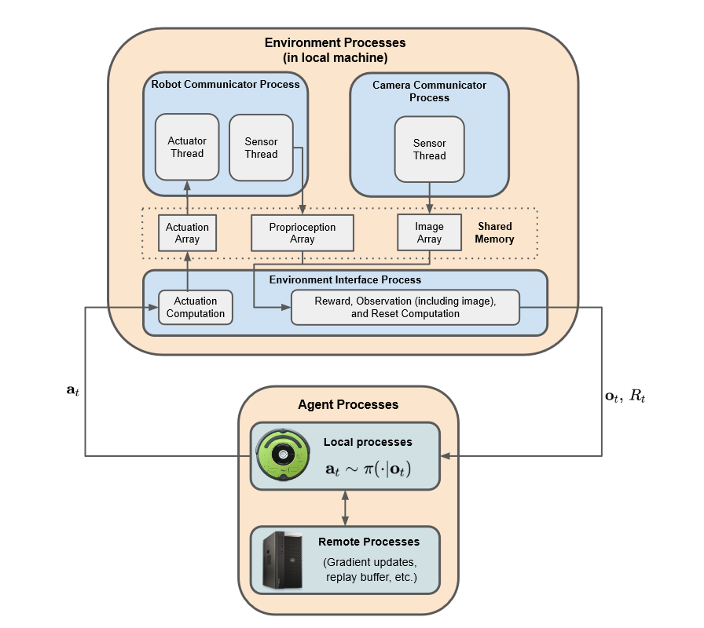

# Real-Time Reinforcement Learning for Vision-Based Robotics Utilizing Local and Remote Computers

## 背景

本文想介绍在本地和远程电脑上的实时强化学习。实时学习是指，机器人边与环境进行交互，边快速学习。强化学习是一种根据环境反馈做出相应变化的一种学习，虽然被用来解决复杂的舵机控制问题，并没有相关研究关注实时的强化学习。

强化学习的个体环境交互被建模成一个马尔可夫决策过程，个体在一系列离散的时间点与环境进行交互。在时间点$t$，个体的状态处于$S_t \in \mathcal{S}$。在状态中，它用一个概率分布$\pi$（策略）采取行动$A_t \in \mathcal{A}$，即$A_t \sim \pi\left(\cdot | S_t\right)$。在下一个时间点$t+1$的时候，个体根据转变概率密度函数$S_{t+1},R_{t+1}\sim p\left( \cdot, \cdot | S_t,A_t\right)$收到了下一个状态$S_{t+1}$和奖励$R_{t+1}$。整个过程在个体收到终止状态后结束。

如SAC的最佳强化学习算法在计算上非常吃力，因此要对机器人进行实时控制，需要将其连接在算力强大的电脑上。一般而言，机器人会与一个本地的电脑相连，而这个本地的电脑会与服务器进行网络通信。在这种配置下，本地的电脑由于资源限制，能在学习中获得多大程度的提升并不知道，如何有效利用网络通信让服务器补足性能的不足也不知道。

SAC是一个off-policy强化学习算法，用来最大化期望返回值和策略熵的权衡。PPO是一种on-policy策略梯度算法，通过收集环境数据优化目标。

## 任务目标

本文提出了两种眼球运动机器人任务，分别为UR5-VisualReacher和Create-Reacher，这两个任务需要一万张图片进行学习，因此用简单的强化学习方法不一定能解决。机器人用的是UR5工业机器人臂和iRobot Create2移动机器人。

**UR5-VisualReacher**是一个基于图片的任务，目标是UR5机械臂需要用手指准确触碰显示屏上的红色斑点。UR5只能在一个矩形框内移动，防止出现碰撞和意外损伤的情况。

**Create-Reacher**目标是让Create2以最快的速度移动到墙壁上的一个绿色纸。

## ReLoD

因此，本文提出了ReLoD系统，将算力分摊到本地计算机和远程计算机上。ReLoD支持三种模式：单远程模式就是将所有算力集中在服务器上、单本地模式就是将所有算力集中在本次计算机上、远程+本地模式就是将算力分布在远程和本地服务器上。

基本流程就是：将整个系统分成好几个步骤，然后不同的模式的步骤执行对象可能不一样，有的是本地计算机做的，有的是服务器做的。

## 结果

在本地电脑上，SAC的表现急剧下降。但是如果将所有计算由服务器来完成，那么也不能补偿性能损失，性能并不能显著提升。如果选择分布式的SAC计算，那么会持续有效提升性能。

根据a、b两图，SAC的表现要比PPO的表现好得多。

对于PPO算法，它对于算力要求没那么高，相对应效果也就是SAC的$\frac{1}{3}$。

## 个人感想

感觉自己对这篇论文的预期太高了，原本想的是会提出一些新的算法或者思路，但是还是用的是已有的算法，做的侧重点是实验。不过强化学习和实时学习这块学到了。
