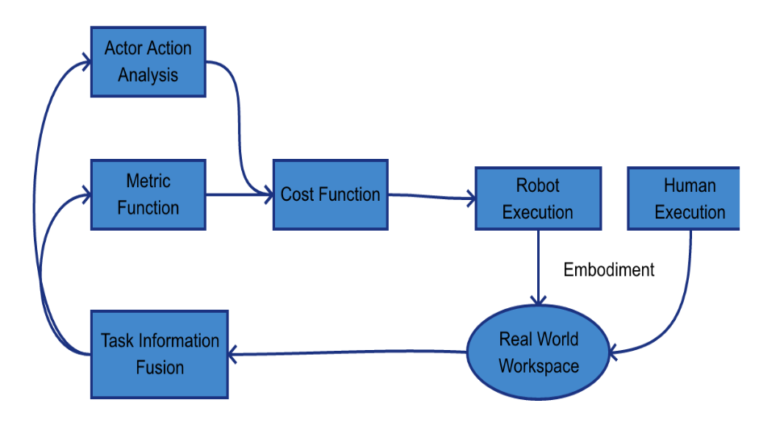

# Robot Action Planning by Commonsense Knowledge in Human-Robot Collaborative Tasks

## 背景

机器人和人工智能的发展拓宽了机械电子一体化的领域。人类通常使用常识，而人工智能通过编码仿照人类根据常识处理每天的情况。常识依赖于场景和上下文。人类具备使用基本知识和关联概念的能力，但机器人在常识这块不能胜任，尤其是没有提前训练的情况下。特斯拉将一个卡车看成了一个立交桥，导致发生了严重的事故。自动驾驶汽车应该使用一些常识，来规避一些根本性的知识错误。

协作机器人是一种帮助人类，使充分发挥人类和机器人优势的机器人。相比于传统机器人，协作机器人更加轻巧，适用的任务范围也更加普遍。一共有四种人机协作：平行协作、轮流协作、分工协作、共同协作。平行协作就是机器人和人类分别有自己的工作区，相互不干扰；轮流协作就是机器人和人类在同一工作区工作，但是工作时间不同；分工协作就是同时在同一个工作区协作，但是做的是不同的任务；共同协作就是同时、在同一个工作区、做同一个任务。如下图所示：

在果树种植领域，机器人能通过“驴模式”、“任务模式”和“脚手架模式”。“驴模式”可以让机器人跟着自己；“任务模式”可以让机器人自己执行任务；“脚手架模式”可以让人站在机器人上进行操作，效率是用梯子的两倍。

本文的任务就是将常识加入机器人中，以让机器人能更高效处理人机协作，并将其运用在有用的领域。

目标确认：

1. 提出一种方法，让常识可以在人机协作被使用。
2. 将上述方法应用在机器人物体评价上，以此检验有效性。

任务的挑战性：把握常识之间的微小差异，也许对人类很容易，但是对于机器人很难。并且，必须要进行充足的协作任务才能在目标任务取得较为满意的成果。

## 方法：CSK-BASED-HRC

在物体拼装的任务中，本文假设了如下前提：

1. 人类更偏向于搬轻的部件。
2. 我们不相信机器人能妥善处理不稳定的部件。
3. 玻璃材质的部件可能会伤到人类。

前提2和前提3可能会冲突，毕竟也有可能有不稳定但是是玻璃材质的部件。这时就需要数学建模来进行决策，通过特征来判断哪个更加重要。

整体的框架如下，人类和机器人的执行会影响下一步的动作。

## 验证测试

在模拟测试环节，使用了四种不同的优先级机制进行测试：常识优先级、无优先级、仅人类使用优先级和最近者优先级高。最后发现，最近者优先级高用时最短。

## 个人感想

前面背景部分补充了很多不知道的知识，对人机交互有了一定了解。但是后面的方法有点太简单了，或许只是一次常识和理论提出，后续应该在此基础上加一些元素。比如大模型促进人机交互。
