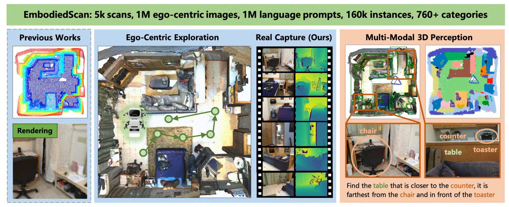

# EmbodiedScan: A Holistic Multi-Modal 3D Perception Suite Towards Embodied AI

## 背景

在计算机视觉和机器人领域，我们寄托于嵌入式智能体能探索环境并处理人类的指令。这需要根据第一人称观察完全理解3D场景，同时将场景于语言进行上下文关联。

但是，传统的研究更多从一个宏观的视角关注于场景级的输入和输出。比如，一些研究将重构的3D点云和网格图作为输入，预测3D物体检测框或者分割点云图。另外，之前的数据集的作为输入的第一人称彩色深度图片不是太小就是缺乏综合性的标注，不能从底层支持研究。单纯地从现有的不完美的网格图中渲染真实的视角是不可行的。另一方面，在真实情况下无法获得新环境的3D重构，因此之前的模型并不能直接应用。

## EmbodiedScan

为了解决这一缺口，本文提出了EmbodiedScan，一个多模态、第一人称3D感知数据集和整体3D场景理解benchmark。其中包括了五千次扫描、一百万个第一人称彩色深度图片视角、一百万个语言提示词、十六万个覆盖超过760种类别的带方向的3D的检测框（部分数据和LVIS数据集一致）和80中常见分类的密集语义场景。

此数据集使用了目前现存的大规模3D场景数据集，但是使用的目的变成了根据第一视角RGB-D图片流持续场景级感知。与先前只提供点云分割标签和少量语义的工作不同，本文使用一个SAM协助的流水线来用带方向的3D的检测框标记物体并生成语言提示词。

在这个数据集的基础上，本文引入一个叫做嵌入感知器（Embodied Perceptron）baseline框架。它可以处理任意数量的多模态输入，并在基本3D感知任务、基本语言任务和现实任务中展示显著的3D感知能力。

通过编码后的2D和3D特征，本文使用密集融合和同构多层融合。之后，利用潜在映射来生成3D场景和物体表示，之后会被用于进一步处理以便解码场地和3D检测框预测。生成的3D表示可以被进一步与特征嵌入相结合，进行3D视觉定位，从而支持基本语言应用。

本文建立了两种benchmark：

1. 基本3D感知：聚焦于传统的任务，比如3D检测和不同输入配置下的语义占地预测。
2. 基本语言场景理解：将3D视觉定位作为一个初步的探索。

### 数据收集与处理

**第一人称感知数据收集**：考虑到目前已经有现存的数据集存在可获得的3D室内场景扫描了，本文就着手于将第一人称RGB-D捕捉图像和对应的相机位置集合。本文从ScanNet、3RScan、Matterport3D数据集中挑选高质量带有必要标注的部分形成初始版本的EmbodiedScan。未来，本文会将ARKitScenes纳入数据集，处理不同数据结构、深度感知和标记。

**选帧和场景划分**：尽管这些数据集都含有RGB-D图像数据，但数据形式、采样频率和视角关系都是不同的。本文会首先在加载图片时通过增加随机性，统一格式为多视角来适应Matterport3D。同时，在推理过程中保持ScanNet和3RScan的线性连续性。因此，本文的模型既可以处理时序图片，也可以处理随机捕捉的多视角图片。

此外，本文将Matterport3D中建筑物规模场景拆分为基于官方标注的区域，将深度图片放入对应的区域中。关于ScanNet和3RScan的图片采样速度，本文对ScanNet进行每10秒采样一个关键帧、对3RScan的所有图像进行保留。

**全局坐标系统**：全局坐标系统对统计多视角观察和为输出做参考很有必要。本文按照ScanNet的常规，以场景中心为原点、地板为水平面、墙壁为轴建立坐标系统。这一后处理会协调数据分布，细微提升在benchmark上的表现。实际的应用可能不会有这种先置全局系统或者会根据观察而变动，这为未来的进一步探索提供了有趣的问题。

### 标注

本文提供了三种类型的标注：3D检测框、语义占地和语言描述，每一个都被用于丰富场景理解的不同层面。

**3D检测框**：根据标准定义，一个立方体会根据它的中心、大小和ZXY欧拉角方向而确定。本文使用分割万物模型（Segment Anything Model, SAM）和一个自定义的标注工具来解决目前3D检测框标注的限制，包括缺少方向和缺少小物体的标注。

此外，本文根据相机位置的变化选取了几张清晰的关键帧并保证其覆盖了不重叠的区域和大部分的物体，从而生成SAM蒙版和与坐标轴对齐的检测框以便进一步调整。本文与一个标注团队合作并在最后检查了标签的质量。

**语义占位**：语义占位使跨语义区域的准确边界变得必要，不需要考虑物体姿势或回忆起所有的物体，因此初始点云分割标注更加适用于提取占位基本事实。对每个立体像素，本文将含有最多点的类别作为语义标签。在感知细粒度和计算效率之间的妥协导致了在沿着水平面和垂直轴的感知范围$[-3.2m \sim 3.2m, -3.2m \sim 3.2m, -0.78m \sim 1.78m]$内的$40\times 40 \times 16$的占位地图。

**语言描述**：给定上传的带有方向的3D检测框，本文将提取描述遵从SR3D的物体间空间关系提示词。其将作为提示词输入到基本语言感知模型来进行3D视觉定位。由于标注后物体密度的上升，识别特定物体会变得更加有挑战性。为了解决这一挑战，本文结合多种空间关系提示词来锁定唯一的物体。

## Embodied Perceptron

Baseline的架构包括了一个多模态3D编码器来提取物体、场景表示，稀疏、密集解码器来处理不同的下游任务。除此之外，本文自定义输入的参数并训练目标来满足稀疏解码器中带方向的3D检测框的公式。

### 多模态3D编码器

多模态3D编码器包括了对不同模态的编码器：ResNet50和FPN（可选）用于编码2D图片，Minkowski ResNet34用于编码点云，BERT用于编码文本。在提取这些特征之后，本文进一步融合和处理这些特征进稀疏的或密集的特征中，用于处理不同的下游任务。

之后，本文先展示如何统计多视角输入，之后为密集和稀疏特征提取引入不同的融合方法。

**输入视角的可拓展性**：与先前的工作相比，本文的框架可以接受任何数量的RGB-D图片视角，使其可适应、可泛化为不同的输入顺序或者数量。通过将点云变化为全局坐标系统，本文很方便就能统计不同深度地图视角。

对于多张图片，本文使用从3D点中进行视角映射获得对应的2D特征，之后进行平均来保持排列的不变量。这一技巧促进了第一人称探索中的持续特征更新。理论上，像素特征会通过合并$t$时刻帧的体积特征和$t+1$时刻的RGB-D输入上的增量特征进行更新。

在实践中，本文推荐任何数量的视角组成batch级样本，这样可以加速训练和评估。

**密集融合**：之前的工作典型地在输入阶段将点的颜色和坐标进行整合，就像“画画”一样，或者形成多模态密集BEV特征来进行融合。后一种方法适合本文占地预测baseline，并因此在预先定义的网格上采用直接密集融合。

**同构多层多模态融合**：具体来说，输入的汇总点$P \in \mathcal{R}^{N_p\times 3}$和$N_i$图片作为输入$I \in \mathcal{R}^{N_i \times H \times W}$通过Minkowski ResNet和一个共享的2D ResNet分别进行处理。这会在$K$层中提取出多层稀疏三维特征$V_k \in \mathcal{R}^{C_k \times N_{V_k}}$和在$S$层中提取图片特征$F_s \in \mathcal{R}^{C_s \times H_s \times W_s}$。实践中，这两个ResNet会产生包括点云和图像的四层特征。这就是同构多模态编码器。

- 在密集融合中，本文利用一个上采样FPN来筛选$F_s$来提取一个$stride=4$的特征映射$F_{up}$，并将其用于和$V_4$融合构建特征空间。
- 对于稀疏融合，本文使用多层特征作为种子而不是一个单密集特征映射来预测3D物体。初始的从$F_{up}$或者原始图片$I$提取静态特征尝试是不稳定的，因为融合的特征不一致，会混淆梯度反向传播。因此，本文利用通过架构来进行基于层级的映射和特征融合。相比于“画画”的方法，这一方法促成了多层、多模态特征融合，保证了不同网络层级和模态之间的特征和梯度的一致性。

**视觉语言融合**：给定多层稀疏视觉特征$F_k^S$和经过文本编码器后的文本特征，本文使用一个多模态融合transformer模型来进行视觉语言信息交互。每一个transformer层使用一个自注意力快来优化稀疏视觉特征并提取空间关系。之后视觉和文本特征在跨模态注意力块中交互。这一交互引导更新后的稀疏基本特征$F^G$对随后的预测能感知到上下文。

### 稀疏&模拟解码器

给定从特定编码器获得的多模态特征，本文使用不同的融合流水线来处理稀疏和密集的任务。经过稀疏融合的四层稀疏空间特征$F^S_k$和一个单一密集特征$F^D$来进行解码和预测。之后这些将被处理来获得3D检测框和占地预测。

**3D检测框预测的稀疏解码器**：通过使用多层融合特征$F_k^S$，本文进行上采样操作，加入3D物体检测需要的分类、回归、中心预测。具体来说，为了使用带方向的3D检测框的输出，本文加入一个六维旋转表示到原始回归对象中，最终解码为一个三维中心$\mathbf{c}$、三维大小$\mathbf{l}$和欧拉角度$\Theta$。

训练目标包括原始分类损失、中心损失和一个对八个角的损失。具体来说角损失，本文使用选择三组解码预测$\{\text{3D centers, 3D sizes, Euler angles}\}$中的一组，同时将其他两组用标准答案代入，从而计算三个角损失。比如，当3D大小和欧拉角度是标准答案，本文可以通过如下公式计算出预测结果$\mathbf{B}$和标准答案检测框$\hat{\mathbf{B}}$之间的角损失：

$$L_c = L_{CD}(\mathbf{B}(\mathbf{c}, \hat{\mathbf{l}}, \mathbf{\Theta}), \hat{\mathbf{B}})$$

和通过整体预测检测框损失$L_{pred}$得到的角损失一起，本文将所有损失进行了平衡，并将其替换为原来的损失，如下所示：

$$L_{loc} = \lambda_\mathbf{c}L_\mathbf{c} + \lambda_\mathbf{l}L_\mathbf{l} + \lambda_\mathbf{\Theta}L_\mathbf{\Theta} + \lambda_{pred}L_{pred}$$

本文设定$\lambda_\mathbf{c} = \lambda_\mathbf{l} = \lambda_\mathbf{\Theta} = 0.2$，$\lambda_{pred}=0.4$来强调整体预测的重要性。

**占地预测的密集解码器**：有了密集特征$F^D$之后，本文使用一个3D FPN来总计多层特征并生成多尺度占地预测。既然任务需要更加强力的低层特征来进行细节理解，每一个尺度的预测会用从高清晰度到低清晰度退化的半权重进行监督。本文使用交叉熵损失和场景类同损失进行训练。在推理阶段，本文只使用高清晰度的输出作为预测。

**3D视觉定位的稀疏解码器**：在每个transformer层后更新的基本特征$F^G$会被喂进和3D预测一样结构的预测头部。每一层中所有的预测头输出会在训练时被监督。一个额外的对抗损失会将视觉特征与目标文本提示词进行对齐，保证目标文本token的特征能更加接近对应的视觉特征，远离其他视觉或文本token。

## Benchmark

本文的Benchmark根据数据样本划分未来三种类别：基于场景、基于视角和基于提示词。基于场景的Benchmark是基于不同的场景，覆盖了连续的、多视角的感知。基于视角的Benchmark使用第一人称视角处理像单视角3D检测任务。基于提示词的Benchmark就是用构造的提示词进行3D视觉定位。

本文使用3D基于IoU的平均精确度，3D检测的阈值为0.25、3D视觉定位的阈值为0.5。本文还用平均召回率作为参考。对于占位预测，本文使用平均IoU作为评估指标。

## 小实验

- 将标注换为带方向的3D检测框，并训练解码器。本文发现表现上有明显的下降。

- 将重构的点云换为多视角深度图片后，对$AP_{25}$没有很大影响，但是对$AP_{50}$影响很大。

- 将渲染的图片切换为真实图片，能看到有很大的差距。

- 本文通过训练相同的模型和其他数据集相比，能看到本文的准确率有所上升。
