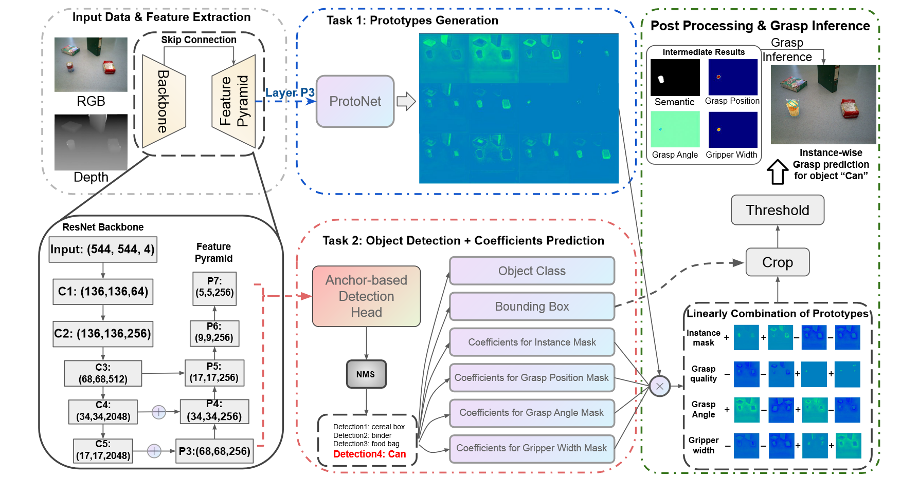

# 机器人抓取

## 摘要

Single-Stage Grasp systhesis network，在OCID-Grasp数据集上获得最好效果，在JACQUARD数据集上表现很不错。

## 相关工作

仅通过一张照片作为输入就进行抓取是很难的。下面是实现图片抓取的两种方法：

1. 通过部位建议网络来找到的抓取。他们将抓取合成方法看成是检测任务，将抓取形状简单视为旋转的矩形。
2. 采用生成模型预测抓取。根据输入图像，模型会生成像素级的抓取形状。

这两种方法只能决定场景中可抓取的部分，而不是整个物体。并且，物体和抓取之间的关系并不清晰，因为特征主要是局部的或者是整体的。

通常论文的解决方案为两步走：1. 找到所有可以抓取的区域，生成抓取形状。2. 在目标检测或语义分割的支持下，将抓取形状分配到特定的物体上。这种两步走的方法缺少了物体和抓取形状的关联性，导致了在实际任务中表现较差。

## SSG

一般而言，抓取形状被定义为一个旋转的矩形，即$\text{Grasp}_{\text{rect}} = \left (x,y,\theta,w,q\right )$，其中$\left(x, y\right)$对应矩形的中心坐标、$\theta$是相对相机网格的旋转角度、$w$是机器人手钳需要拉伸的宽度、$q$是抓取的质量（Quality）。本文加入了一个附加标签$cls$来标记诶个抓取形状属于哪一个物体。

此外，对于每个物体实例，本文将其对应的真实抓取形状嵌入多种mask中，用来显示抓取位置、抓取质量、抓取角度和手钳所需宽度。其中，抓取质量是通过统计像素点被覆盖的抓取矩形数量，再代入Sigmoid函数获得的。

本文提出了Single-Stage Grasp(SSG) systhesis network模型，之所以称为一步走，是因为它可以直接根据物体实例生成grasp configuration。SSG将抓取任务拆分成了两个平行任务：1. 根据输入的RGB-B图像，生成一系列原型mask，可以被当作词汇或者整体的描述子。2. 物体检测，并预测额外的一系列系数。最后，通过Non-Maximum Suppression，这些系列系数用于线性组装原型mask，以生成实例分割和抓取mask（像素级的抓取形状）。

检测框、类别标签、实例mask和抓取mask都根据每个检测到的物体同时进行生成，这样就可以保持物体和抓取的联系。整体的流程图如下所示：

在特征提取模块，使用ResNet-101和Feature Pyramid Network从输入的RGB-D图像中来提取多尺度特征。在原型mask生成模块，使用$k$通道的全连接卷积神经网络来生成一系列原型mask。**一个非常重要的现象是：训练好的原型mask被泛化成不同的域，通过使用不同的系数，让原型mask之间进行组合，就可以得到实例mask和抓取mask。**在物体检测分支，通过在基本目标检测的基础上增加$N$个额外的头，从而预测$N\times k$个系数。具体而言，对于每一个通过Non-Maximum Suppression的物体，可以预测其类别、检测框、用来组合实例mask的$k$个系数、用来组合抓取位置mask的$k$个系数、用来组合抓取角度mask的$2 \times k$个系数和用来组合宽度mask的$k$个系数。

**目标mask生成**：$\mathbf{P}$表示原型mask，大小为$h\times w\times k$；$\mathbf{C}$表示表示系数，大小为$N\times k$。目标mask用$\mathbf{M}$表示，计算公式为$\mathbf{M} = \text{激活函数}\left( \mathbf{P}\mathbf{C}^\top\right )$，激活函数随着不同的mask会不同。

**损失函数**：分类损失、检测框损失、语义分割损失、实例分割损失和抓取合成损失。其中，抓取合成损失包括抓取位置损失、抓取质量损失、抓取角度损失、抓取宽度损失。

## 验证测试

如何判断抓取是合适的？1. 类别正确；2. 角度与真实值相差$30^{\circ}$以内；3. 抓取矩阵的交集比例必须大于$0.25$。

OCID-Grasp准确率超过$90\%$，在其他模型中表现最好；JACQUARD表现得也不错。

**模拟和实际机器人实验**：1. （模拟）单物体抓取和放置任务；2. （真实环境）桌子清理任务。

SSG在高度混乱的场景中（物体存在10%-25%的重叠区域），也能很好地合成实例化的抓取形状，而其他双步骤方法不行。并且，这种方法可以被各种机器人操作任务所使用，能作为一种普遍的流水线。

**可拓展性**：为了验证可拓展性，重新将SSG模型训练Object Stacking Grasping Dataset (OSGD)数据集。在这个数据集中，包括了切、写、敲、叉、推、拉、捏、拧、舀、刷、递一共11种不同的动作。因此，本文在物体检测模块增加了11个额外的头，来预测11种系数。通过结果显示可以看出表现得很不错。

**消融实验**：1. 去除预测分类标签；2. 去除生成实例mask。从结果中可以看出准确率都有所下降。

## 个人感想

我觉得mask线性叠加的思路是这篇论文的精髓。不过我比较担心每次是否都需要自行定义叠加的公式，如果是这样，那么还是有人工的成分在里边的。不过一旦定义好公式，机器人就能开始抓取的话，也是可以接受的。
