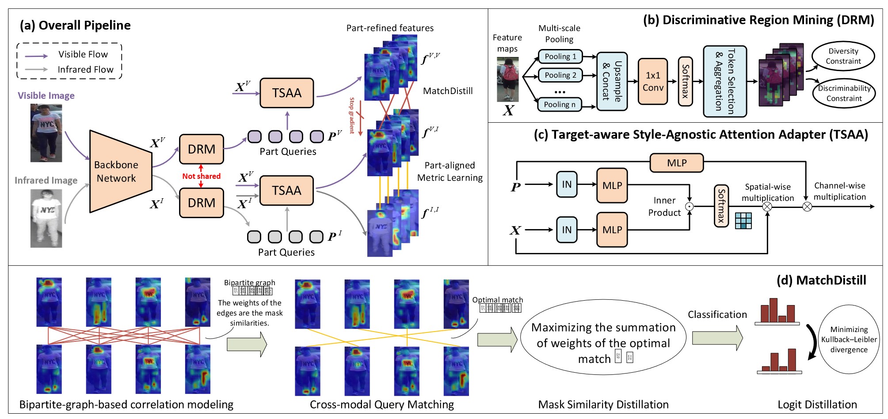

# Learning Concordant Attention via Target-aware Alignment for Visible-Infrared Person Re-identification

## 背景

行人重识别（Re-ID）通过不重叠的相机来联系行人实体。目前这在真实监控系统的应用上有广泛关注。

传统的方法主要侧重于对不同的相机提取相同的实体。尽管这种方法取得了显著的成功，但是受到了弱光条件（夜晚）的限制。未来提升光照的限制，红外相机将与可见光照相机一起在真实监控系统中使用。而任务就变为了：可见光-红外线跨模态行人重识别（VI Re-ID），在不同光谱下拍摄行人照片来进行长期行人跟踪。

与传统彩色照片重识别不同，VI Re-ID会因为彩色和红外图像之间的差距增加识别的难度。由于VI Re-ID各种数据之间存在巨大的分布差距，本文指出目前的范式经常会出现模态间语义对不齐的现象，因此无法准确对齐、比较局部细节。除此之外，VI Re-ID和Re-ID一样也会受到姿势、环境改变的影响。

目前大多数的方法只考虑了整个图像的全局表示，而没有比对图像的局部细节。除此之外，一种看似直接的方法就是用分离技术、辅助模型技术或者注意力技术来学习语义对齐局部特征。但是，这些方法无法取得模态间的语义对齐。如果强制将这些对不齐的语义嵌入对齐会对训练过程造成破坏，降低最终表现。

与这些深度学习方法不同，人类视觉系统由于有目标级比对策略，能很自然避免无法对齐的问题。考虑到比较两张行人照片的场景，人类视觉系统会首先在目标图像上识别多个不同的关键区域，并与主图像中的对应区域进行比对。在这种方法下，人类可以一直进行部分之间的比对直到找到了合适的匹配。这个思路说明从找到目标图像上的模态对应部分和有效的跨模态对应区域搜索策略能解决模态间的语义不对齐问题。

## CAL

### 数学基础

令$x^k$为模态$k$的训练图片，$k\in \{V, I\}$（$V$为可见光模态、$I$为红外线模态）。可见光和红外线样本在数据集中分别表示为$\mathcal{V} = \{x_j^V, y_j^V\}_{j=0}^{N_v}$和$\mathcal{I} = \{x_j^I, y_j^I\}_{j=0}^{N_i}$。其中$N_v$和$N_i$为数据集中每种模态的样本数量、$y_j^k$为模态$k$中第$j$个样本的对应实体标签。VI Re-ID的目标是根据特征的相似性进行跨模态的行人实体匹配。因此，减少各种样本间的类内差异是很重要的。现有的范式经常通过直接优化如下公式来减少差异。

$$\mathbb{E}_{i,j}\left [ \mathbb{1} (y_i^V=y_j^I)\cdot \mathrm{d}(f(x_i^V), f(x^I_j))\right ]$$

其中$f$为特征提取器，$\mathrm{d}(\cdot, \cdot)$为特征时间的距离。

### TCA

本文提出协调注意力学习（CAL），一种为VI Re-ID学习语义对齐表示的新框架。

具体来说，本文设计一个目标级协调对齐（TCA）范式，在对齐各种样本的时候允许目标级注意力适应。分为显著区域挖掘（DRM）、目标级样式无关的特征适应器（TSAA）和部分对齐度量学习三部分。

**显著区域挖掘**：从每个训练样本的特征映射中识别不同的、显著的关键区域。标记为$\gamma(\cdot)$。

**目标级样式诊断特征适应器**：将从目标模态中提取的关键区域作为query，使用目标级改良来适应特征注意力、生成部分对齐的嵌入。特征提取器标记为$f(x, p)$，用于表示上述动态特征调整过程，$p$表示为给定的关键部分。

那么，用于减少跨模态类内差异的目标函数为：

$$\mathbb{E}_{i,j,k}\left [\mathbb{1}(y_i^V = y_j^I) \cdot \mathrm{d} (f(x_i^V, \gamma(x_j^I)k), f(x_j^I, \gamma(x_j^I)k)) + \mathbb{1}(y_i^I = y_j^V) \cdot \mathrm{d} (f(x_i^I, \gamma(x_j^V)k), f(x_j^V, \gamma(x_j^V)k))\right]$$

这种方法下，被优化的嵌入可以取得语义的协调，因为相通的query被用于引导特征注意力（比如$f(x_i^V, \gamma(x_j^I)k)$和$f(x_j^I, \gamma(x_j^I)k)$由于使用了相同的部分query $\gamma(x_j^I)k$,会对应相同的语义区域）。

#### DRM

显著区域挖掘模块目标为从源于骨架网络的特征映射$X \in \mathbb{R}^{C\times H \times W}$找到不同的显著关键区域，其中$C$、$H$和$W$分别表示特征映射的通道、高度和宽度的数量。

DRM包括两个阶段：部分打分与token选择聚合。前者会将token分类为$N$个不同的部分，后者会根据打分为每个部分选择前$k$个token，并将他们进行聚合。

**部分打分**：为了将特征映射拆分成不同的显著区域，本文首先设计一个简单的打分网络$\gamma_\theta$来对特征映射中的每个token预测$N_p$个显著部分的分数。其中，$N_p$表示为部分的数量，是一个超参。具体来说，特征映射$X$会经过多个大小不一样的最大池化层来获得不同角度的特征。这些特征之后会进行下采样并在通道维度上拼接。最后，拼接好的特征映射会进入一个点级卷积层，使用softmax激活函数和空间函数来预测每个部分的分数。

**token选择聚合**：通过$\gamma_\theta$得到的分数，本文之后对每个部分选择最高$k$个分数的token，并将其通过加权平均进行聚合，从而得到聚合的部分特征。具体来说，令$S \in \mathbb{R}^{(H\cdot W) \times N_p}$为$\gamma_\theta$+softmax层得到的预测分数；令$T \in \mathbb{R}^{(H\cdot W) \times C}$为压平的$X$。token选择聚合的过程如下公式所示：

$$P = \frac{\hat{S}^T T}{\sum_j \hat{S}_j}, \text{where}\hat{S} = \mathcal{T}(S, N_k), N_k = \left \lceil \alpha \cdot \frac{H\cdot W}{N_p} \right \rceil$$

其中，$\mathcal{T}$为top-k操作；$\hat{S} \in \mathbb{R}^{(H \cdot W) \times N_p}$为选择的区域；$N_k$为选择token的数量，$\alpha$是控制选择比例的超参；$P \in \mathbb{R}^{N_p \times C}$为聚合的部分特征。相比于保留所有的token，选择top-k个token有两大好处：

1. 过滤掉会对下面模块造成噪音的token。
2. 提升选择区域的局部性，促进学习局部特征。

**显著性限制**：未来保证部分特征$P$包含了显著的信息，本文设计了显著限制损失，如下所示：

$$\mathcal{L}_{dis} = - \sum_{i=1}^{N_p} \log(\Phi_i (P_i)_y)$$

其中，$\Phi_k$表示带有全连接层+softmax的特定部分的分类器；$y$为目前样本的标签

**多样性限制**：仅仅依靠显著性限制训练DRM的话，模型会倾向于选择相同的区域，出现一个次优现象。为了提升选择区域的多样性，本文进一步设计了多样性限制损失，如下所示：

$$\mathcal{L}_{div} = \sum_{i,j} \text{triu}(\hat{S}^T\hat{S}, 1)_{i,j}$$

其中，$\text{triu}(\cdot, 1)$函数为矩阵取上三角部分。这个多样性限制损失相当于在关键部分之间过于相似的时候提供惩罚。

#### TSAA

为了实现目标级注意力，恰当地通过将聚合部分特征$P$作为参考在特征映射中定位相关的区域是很重要的。一种直观的方法是将$P$作为部分query，压平的特征映射$T$作为key和value，直接进行点积注意力。公式如下：

$$\text{Attn}(T;P) = \text{softmax}(PT^T / \sqrt{d})T$$

其中，$d$为特征维度。然而，这种简单的方法仅仅将点积作为了相似性度量，而这样可能会造成错误的注意力分数。因为不同的模态特征会遭受很大的分布移动，导致特征之间无法准确比较。

---

因此，本文设计了TSAA，提供了一个更加合理的相似度计算。本文首先为部分query$P$和特征映射$X$中的每一个token进行实例标准化（IN）。如下所示：

$$\text{IN}(P) = \frac{P - \mu (T_P)}{\sigma (T_P)}, \text{IN}(T) = \frac{T - \mu(T)}{\sigma(T)}$$

其中，$\mu(\cdot)$和$\sigma(\cdot)$为计算实例级均值和标准差的函数；$T_P$为压平的$P$。这么设计的目的是可见光图像和红外线图像的模态差距可被视为样式上的巨大差异。而IN在相关研究中被证明其在减小样式方差上的有效性。

之后，标准化的特征被喂入多层神经网络来学习非线性映射、捕捉特征的复杂模式。本文之后会计算映射特征的内积，并在空间维度使用softmax来得到最终的相似度。本文之后通过使用相似度进行加权平均，实现空间注意力。另外，本文也使用query引导的通道注意力来在特征映射中突出重要的通道，并遏制不怎么重要的通道。其中通道注意力的分数是由一个MLP层，将部分query作为输入得到的。

整个TSAA模块用$\mathcal{A}(\cdot ; \cdot)$进行表示，公式如下：

$$\begin{aligned}
\mathcal{A}(T;P) = \mathscr{S}(T, P)T\otimes\mathcal{M}(P;\theta_3) \\
\mathscr{S}(T, P) = \text{softmax}(\hat{P}\hat{T}^T/ \sqrt{d})\\
\hat{T} = \mathcal{M}(\text{IN}(T);\theta_1), \hat{P} = \mathcal{M}(\text{IN}(P);\theta_2)
\end{aligned}$$

其中，$\mathscr{S}$为空间相似度计算函数，$\otimes$为通道级乘积，$\mathcal{M}(\cdot; \theta)$为带参数$\theta$的MLP。

TSAA有两大优点：

1. 能够给予任何给定的部分query$P$进行样式无关的注意力调整，能更加轻松达到注意力一致。
2. 能通过注意相关的区域和突出相关的通道来自然地补足跨模态样本之间的差距。

#### 部分对齐度量学习

部分对齐度量学习的目标为减少跨模态部分对齐的特征类内差异。既然TSAA可以有效补足跨模态样本之间的差异，本文先使用TSAA进行跨模态改良。如下所示：

$$f_i^{V,I} = \mathcal{A}(T_j^V ; P_i^I), f_i^{I,V} = \mathcal{A}(T_j^I ; P_i^V)$$

其中，$T_j$为$y_i^I=y_j^V$中随机选取的特征映射；$f^{V,I}$和$f^{I,V}$为跨模态改良好的特征。类似的，本文使用如下公式进行自改良：

$$f_i^{V,V} = \mathcal{A}(T_i^V; P_i^V), f_i^{I,I} = \mathcal{A}(T_i^I; P_i^I)$$

由于$f_i^{V,I}$和$f_i^{I,I}$使用了相同的query，两者会关注于相同的区域，并因此被视为部分对齐的特征。本文之后设计了部分对齐中心损失（PCL）来提升语义对齐嵌入的可辨别性。令$c_j^k$为模态$k$中类别$y_j^k$的batch特征中心，其计算公式为：

$$c_j^V = \frac{1}{|\mathcal{S}(j)|}\sum_{i \in \mathcal{S}(j)}f_i^{V,V}, c_j^I = \frac{1}{|\mathcal{S}(j)|}\sum_{i \in \mathcal{S}(j)}f_i^{I,I}$$

其中$\mathcal{S}(j) = \{i | y_i = y_j\}$。PCL计算公式为：

$$\mathcal{L}_{pcl} = \sum_{i, j}[\mathbb{g}(f^{VI}_i, c_j^I) + \mathbb{g}(f^{IV}_i, c_j^V) + \mathbb{s}(c^{I}_i, c_j^V) + \mathbb{s}(c^{I}_i, c_j^I) + + \mathbb{s}(c^{V}_i, c_j^V)]$$

其中，$\mathbb{g}$和$\mathbb{s}$目标分别为聚集类内特征、区别类间特征。公式分别为：

$$\begin{aligned}
\mathbb{g}(f, c) &= [\mathbb{1}(y_{(f)} = y_{(c)}) \cdot \left \|  f - c \right \|_2] \\
\mathbb{s}(c_i, c_j) &= [\mathbb{1}(y_{(c_i)} \ne y_{(c_j)}) \cdot [\sigma - \left \| c_i - c_j \right \|_2]_+]
\end{aligned}$$

其中，$\sigma$是一个边界参数；$[z]_+ = \max (z, 0)$；$y(\cdot)$为对应嵌入/中心的标签。

---

### MatchDistill

尽管目标级改良方案可以通过使用目标模态上的线索来缓解模态的差异，但它在推理中带来更高的计算成本。因为它需要为所有query-gallery配对都执行一次，而gallery库中的样本很多。

因此，本文进一步提出MatchDistill，让DRM直接生成类似目标模态的部分特征。具体来说，通过用跨模态query匹配算法来关联$P^V$和$P^I$并聚集特定模态的知识为另一模态的最佳匹配query。

由于MatchDistill是一个对称的流水线，本文将从$P^I$到$P^V$的知识匹配和聚集作为例子。本文首先构造出一个完全二分图$G(U, V, E)$，其中结点集$U$、$V$分别表示$P^I$和$P^V$。$E$中的每一条边从$U$一点连接到$V$中的一点。边的权重为query之间的语义相似度，计算公式如下：

$$w(E_{k_1, k_2}^V) = \left \langle \mathscr{S}(X^V, P^I_{k_1}), \mathscr{S}(X^V, P^I_{k_2}) \right \rangle$$

其中，$w(\cdot)$表示边的权重。如果$P_{k1}$和$P_{k2}$表示着相同的语义区域，那么注意力mask应该会有很高的相似度。整个部分query匹配问题如下公式所示：

$$\begin{aligned}
\arg \max_{M \subseteq E} \sum_{e \in M}, &s.t. |M| = N_p \text{ and}\\
\forall (u_1, v_1), (u_2, v_2) \in M, &u_1 \ne u_2 \text{ and } v_1 \ne v_2
\end{aligned}$$

其中，$M$表示为优化匹配的边缘（$\forall (u, v) \in M$，$P_u^V$和$P_v^I$表示着相同的语义区域）。本文使用Kuhn-Munkres分配算法来解决该问题。之后，所有$(u, v) \in M$配对都可以使用相互知识聚集过程，因为是语义对齐的。具体来说，提出的知识提取通过两层被执行，特征层和分数层。对于特征层，本文对最佳匹配的query配对进行相似度映射对齐。这与最大化优化二分图相同，公式为：

$$\mathcal{L}_{kd1} = - \sum_{e \in M} w(e)$$

对于分数层，本文通过如下公式限制两者softmax分类的一致性。

$$\mathcal{L}_{kd2} = \sum_{(u, v) \in M} \mathcal{D}_{kl}(p_u^{V,I} \parallel p_v^{V, V})$$

其中，$p$表示后softmax分类的概率，$\mathcal{D}_{kl}$表示Kullback–Leibler散度。

训练MatchDistill之后，每个模态可以从另一模态学到知识，并且在推理阶段不需要跨模态的交互。另外，通过优化$\mathcal{L}_{kd1}$和$\mathcal{L}_{kd2}$，本文观察到随着训练的进展，优化配对$M$会逐渐趋于稳定。这表明在最后训练阶段的最高出现率的优化匹配，令其为$\hat{M}$，会被用来进行测试匹配。

### 训练

整体训练目标为：

$$\mathcal{L} = \mathcal{L}_{id} + \mathcal{L}_{pcl} + \lambda_1 \mathcal{L}_{kd1} + \lambda_2 \mathcal{L}_{kd2} + \lambda_3 \mathcal{L}_{dis} + \lambda_4 \mathcal{L}_{div}$$

其中，$\mathcal{L}_{id}$为常规实体分类损失，$\lambda$为超参。

## 实验

实验展示出CAL的有效性和优越性。在两个数据集中都是SOTA效果。

- TCA和MatchDistill具备有效性。
- 如果没有多样性限制和显著性限制，性能会下降。
- 将模态特定DRM换为模态共享DRM，性能也会下降。
- 将DRM换为可学习向量、水平分割性能都会显著下降。
- 如果将TSAA中的query引导通道注意力机制换为规模点积操作，性能会下降。
- PCL具备有效性，并相比与其他方法都更有效。
- MatchDistill各部分都具备有效性。

通过量化分析，可以看到模型会提取行人的各个明显区域，进行比对。

