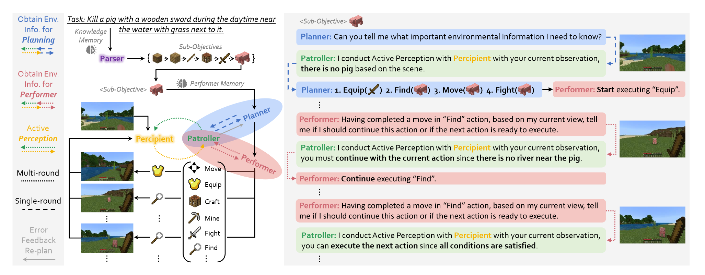

# MP5: A Multi-modal Open-ended Embodied System in Minecraft via Active Perception

## 背景

一些工作基于Minecraft构建了Open-ended Embodied Agent这一概念。

但是存在一些问题：

- 推理能力不足，不能解决长程问题。
- 盲目的LLM不能理解上下文。
- 需要持续性的环境交互来检查任务。

## MP5

对问题进行解耦合，分为目标和场景。

规划者与巡逻者进行交互，根据新的信息重新规划任务。规划者指导行动者进行操作。

## future

后续会使用chain-of-imgagination的方式进行推理。
