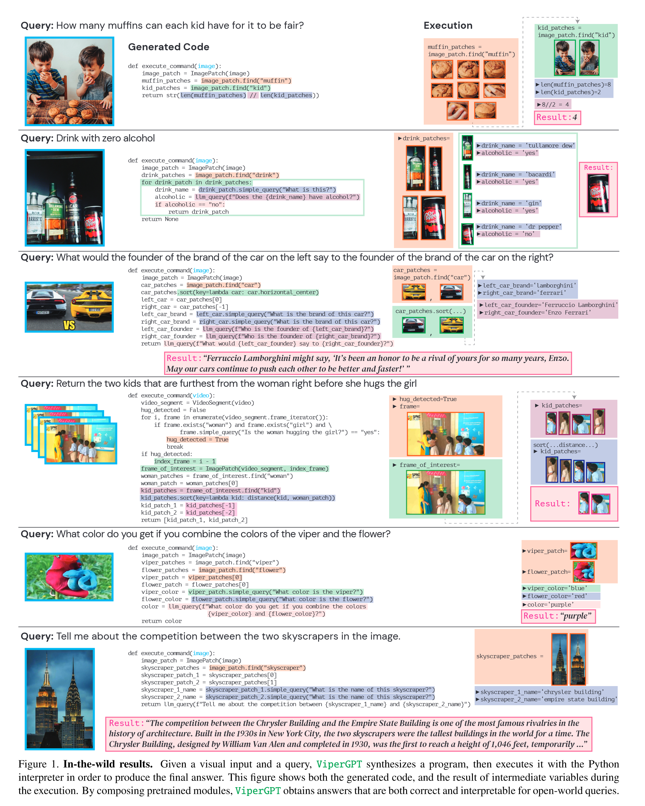

# ViperGPT: Visual Inference via Python Execution for Reasoning

## 背景

目前主流的、用于回答视觉请求任务的AI端到端模型并没有明显将视觉处理和推理区分开来，导致缺乏可解释性和泛化性。

## ViperGPT

七个优点：可解释性、逻辑性、灵活性、组合性、可适应性、无训练、通用性。

特点：

1. 生成Python代码并执行，具有多样性比如排序、遍历等。
2. API部分有增加，可以处理视频和图像。
