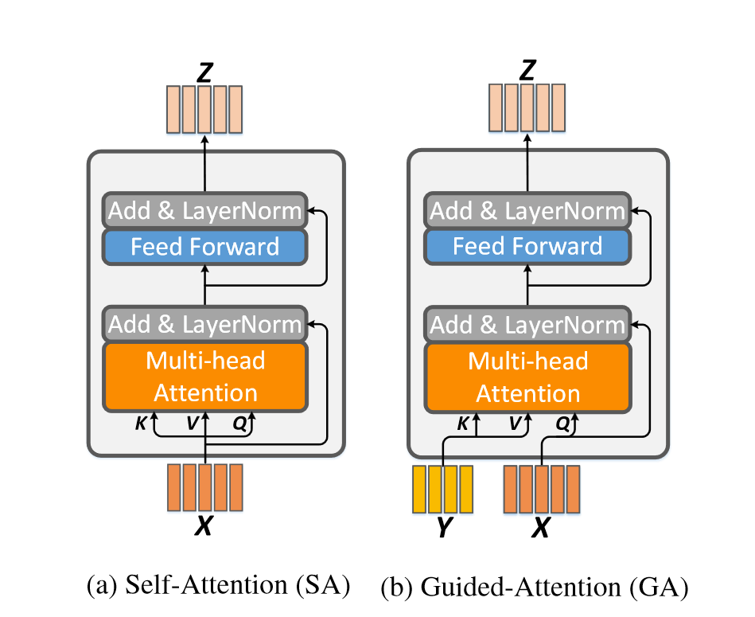

# Deep Modular Co-Attention Networks for Visual Question Answering

## 背景

多模态学习用于构造视觉和语言之间的桥梁，使计算机视觉和自然语言处理领域的学者非常感兴趣。在视觉语言任务中，取得了许多进展，如图像文本匹配、视觉描述、文本引导视觉注意制定目标和VQA等。

相比于其他任务，视觉问答需要对于图片的视觉内容和问题的文本内容有细粒度和同时的理解。

因此VQA的关键在于设计一个有效的协同注意力模型，来将问题中的关键字和图像中的关键目标进行联系。注意力机制是最近深度神经网络的突破，通常被应用于单模态任务，如文字、视觉、语音和之前提到的多模态任务。

到目前为止，大多数成功在协同注意力的尝试在浅层模型取得成效，而深度模型对于浅层模型只有微小的提升。

受到Transformer模型的启发，本文设计了两个基本注意力单元：自注意力（SA）单元和引导注意力（GA）单元。其中引导注意力单元用来通过文字引导图像注意力。通过组合SA和GA注意力单元，我们可以组合成不同的MCA层，从而在深度上进行堆叠。

最后，本文提出由MCA层堆叠而成的MCAN，从图像中红色线可以看出，随着深度的叠加，模型效果有所提升。另外，本文发现模型自注意力会显著提升物体数量，这对VQA锁定正确的物体是一个挑战。

## 相关工作

**VQA**：最直观的方法是使用多模态全局特征融合，通过将文本和视觉的全局特征通过多模态融合模型来预测答案。一些模型通过LSTM学习到更好的问题特征表示，也有通过残差网络来获得一个更好的多模态融合模型。

上述简单模型的缺点是，如果面对一些局部的图片区域内的问题，单凭全局特征无法回答。所以有很多加入注意力机制的VQA方法的研究。

**协同注意力模型**：目前许多协同注意力模型割裂地学习模态的特征和分布，忽视了模态之间的联系。因此也有许多密集协同注意力模型，侧重于注意力之间的联系。

## MCAN

本文提出一个深度模块化协同注意力网络（deep Modular Co-Attention Network, MCAN），其由多个模块化协同注意力层（MCA）深度上堆叠而成。每个MCA层由问题、图像自注意力和问题引导图像注意力两个基本单元组成。

缩放点积注意力机制（Scaled Dot-Product Attention）包括请求$q$、维度为$d_{\text{key}}$的关键词$K$和维度为$d_{\text{value}}$的价值$V$。为了简化，$d_{\text{key}}$和$d_{\text{value}}$通常相等。我们通过如下公式将$q$、$K$计算作为$V$的权重。

$$f = A(q, K, V) = \text{softmax}\left (\frac{qK}{\sqrt{d}}\right )V$$

其中，$q \in \mathbb{R}^{1\times d}$，有$n$对关键字-值配对（$K \in \mathbb{R}^{n\times d}$、$V \in \mathbb{R}^{n\times d}$），得到的特征$f \in \mathbb{R}^{1\times d}$。

为了提升参与的特征的表示容量，可以使用多头注意力机制（multi-head attention）。$h$个互相独立的头会单独做一个缩放点积注意力机制，公式如下：

$$f = MA(q, K, V) = [\text{head}_1, \text{head}_2,\dots ,\text{head}_h]W^o$$

$$\text{head}_j = A(qW^Q_j, KW^K_j, VW^V_j)$$

其中，$W^Q_j, W^K_j, W^V_j \in \mathbb{R}^{d\times d_h}$，代表第$j$个头的映射矩阵；$W^o \in \mathbb{R}^{h*d_h\times d}$，因此最后乘积得到的大小为$\mathbb{R}^{1 \times d}$。$d_h$每个头输出的维度。

为了防止多头注意力模型变的太大，通常$d_h = d/h$。并且，在实际操作中，我们可以将$m$组询问组合成$Q = [q_1;q_2;\dots;q_m]\in \mathbb{R}^{m\times d}$，将其替换多头注意力公式中的$q$。这样得到的特征$F \in \mathbb{R}^{m \times d}$。最后得到的输出大小为$\mathbb{R}^{m \times d}$。

**SA**：$X = [x_1;\dots;x_m]\in \mathbb{R}^{m \times d_x}$用于同时充当多头注意力的$K, V, Q$。得到的输出并于$X$进行加权相加。之后进行残差连接和层级归一化处理。输入到结构为$(\text{FC}(4d)\text{-ReLU-Dropout}(0.1)\text{-FC}(d))$的全连接层中。最后再进行残差连接和层级归一化处理。

**GA**：$X \in \mathbb{R}^{m \times d_x}$，并且$Y = [x_1;\dots;x_m]\in \mathbb{R}^{n \times d_y}$，用$Y$来引导$X$的学习。并且$X$和$Y$的大小是比较灵活的。

## 实验结果
