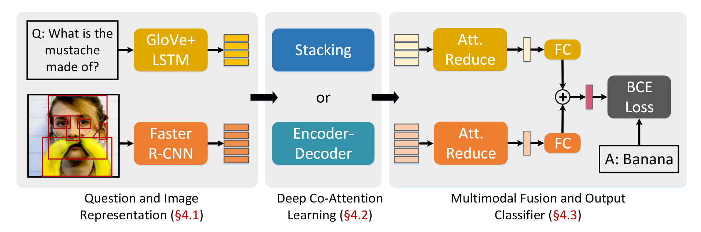

# Deep Modular Co-Attention Networks for Visual Question Answering

## 背景

多模态学习用于构造视觉和语言之间的桥梁，使计算机视觉和自然语言处理领域的学者非常感兴趣。在视觉语言任务中，取得了许多进展，如图像文本匹配、视觉描述、文本引导视觉注意制定目标和VQA等。

相比于其他任务，视觉问答需要对于图片的视觉内容和问题的文本内容有细粒度和同时的理解。

因此VQA的关键在于设计一个有效的协同注意力模型，来将问题中的关键字和图像中的关键目标进行联系。注意力机制是最近深度神经网络的突破，通常被应用于单模态任务，如文字、视觉、语音和之前提到的多模态任务。

到目前为止，大多数成功在协同注意力的尝试在浅层模型取得成效，而深度模型对于浅层模型只有微小的提升。

受到Transformer模型的启发，本文设计了两个基本注意力单元：自注意力（SA）单元和引导注意力（GA）单元。其中引导注意力单元用来通过文字引导图像注意力。通过组合SA和GA注意力单元，我们可以组合成不同的MCA层，从而在深度上进行堆叠。

最后，本文提出由MCA层堆叠而成的MCAN，从图像中红色线可以看出，随着深度的叠加，模型效果有所提升。另外，本文发现模型自注意力会显著提升物体数量，这对VQA锁定正确的物体是一个挑战。

## 相关工作

**VQA**：最直观的方法是使用多模态全局特征融合，通过将文本和视觉的全局特征通过多模态融合模型来预测答案。一些模型通过LSTM学习到更好的问题特征表示，也有通过残差网络来获得一个更好的多模态融合模型。

上述简单模型的缺点是，如果面对一些局部的图片区域内的问题，单凭全局特征无法回答。所以有很多加入注意力机制的VQA方法的研究。

**协同注意力模型**：目前许多协同注意力模型割裂地学习模态的特征和分布，忽视了模态之间的联系。因此也有许多密集协同注意力模型，侧重于注意力之间的联系。

## MCAN

本文提出一个深度模块化协同注意力网络（deep Modular Co-Attention Network, MCAN），其由多个模块化协同注意力层（MCA）深度上堆叠而成。每个MCA层由问题、图像自注意力和问题引导图像注意力两个基本单元组成。

### 注意力单元

缩放点积注意力机制（Scaled Dot-Product Attention）包括请求$q$、维度为$d_{\text{key}}$的关键词$K$和维度为$d_{\text{value}}$的价值$V$。为了简化，$d_{\text{key}}$和$d_{\text{value}}$通常相等。我们通过如下公式将$q$、$K$计算作为$V$的权重。

$$f = A(q, K, V) = \text{softmax}\left (\frac{qK}{\sqrt{d}}\right )V$$

其中，$q \in \mathbb{R}^{1\times d}$，有$n$对关键字-值配对（$K \in \mathbb{R}^{n\times d}$、$V \in \mathbb{R}^{n\times d}$），得到的特征$f \in \mathbb{R}^{1\times d}$。

为了提升参与的特征的表示容量，可以使用多头注意力机制（multi-head attention）。$h$个互相独立的头会单独做一个缩放点积注意力机制，公式如下：

$$f = MA(q, K, V) = [\text{head}_1, \text{head}_2,\dots ,\text{head}_h]W^o$$

$$\text{head}_j = A(qW^Q_j, KW^K_j, VW^V_j)$$

其中，$W^Q_j, W^K_j, W^V_j \in \mathbb{R}^{d\times d_h}$，代表第$j$个头的映射矩阵；$W^o \in \mathbb{R}^{h*d_h\times d}$，因此最后乘积得到的大小为$\mathbb{R}^{1 \times d}$。$d_h$每个头输出的维度。

为了防止多头注意力模型变的太大，通常$d_h = d/h$。并且，在实际操作中，我们可以将$m$组询问组合成$Q = [q_1;q_2;\dots;q_m]\in \mathbb{R}^{m\times d}$，将其替换多头注意力公式中的$q$。这样得到的特征$F \in \mathbb{R}^{m \times d}$。最后得到的输出大小为$\mathbb{R}^{m \times d}$。

**SA**：$X = [x_1;\dots;x_m]\in \mathbb{R}^{m \times d_x}$用于同时充当多头注意力的$K, V, Q$。得到的输出并于$X$进行加权相加。之后进行残差连接和层级归一化处理。输入到结构为$(\text{FC}(4d)\text{-ReLU-Dropout}(0.1)\text{-FC}(d))$的全连接层中。最后再进行残差连接和层级归一化处理。

**GA**：$X \in \mathbb{R}^{m \times d_x}$，并且$Y = [x_1;\dots;x_m]\in \mathbb{R}^{n \times d_y}$，用$Y$来引导$X$的学习。并且$X$和$Y$的大小是比较灵活的。

我们可以通过多头注意力公式尝试理解SA和GA设计的目的。SA中，对于$x_i \in X$，特征$f_i = \text{MA}(x_i, X, X)$，可以被理解为通过将$X$中所有样本与$x_i$的相似度*重新构造*$x_i$。同样地，GA中，对于$x_i \in X$，特征$f_i = \text{MA}(x_i, Y, Y)$，是通过将$Y$中所有样本与$x_i$的相似度*重新构造*$x_i$。

### MCA层

之后，将注意力单元进行组合，本文设计了三种MCA层。需要注意的是，所有这些MCA层的输入和输出大小一样，因此MCA层之间可以进行堆叠。

**ID(Y)-GA(X,Y)** 是本文的baseline。输入问题特征直接传递给输出的问题特征，然后图片的输出特征是经过文本特征引导而计算出的。

**SA(Y)-GA(X,Y)** 则先对文本进行自注意力机制，再引导视觉输出特征。

**SA(Y)-SGA(X,Y)** 先分别对文本和图片进行自注意力机制，之后再通过引导输出视觉特征。

其他的MCA变体比如GA(X,Y)GA(Y,X)和SGA(X,Y)-SGA(Y,X)也有相关尝试，但是效果不佳。

### 问题和图像表示

输入图片被表示成一组自下而上的区域视觉特征。直接使用了在Visual Genome数据集预训练的Faster R-CNN模型（用ResNet-101作为骨干）。本文为检测物体的概率设置了置信阈值，使得物体的动态数量在区间$m \in[10, 100]$。对于第$i$个物体，特征通过从检测区域内的卷积特征进行平均池化，表示为$x_i \in \mathbb{R}^{d_x}$。最终，整个图像被表示为特征矩阵$X \in \mathbb{R}^{m \times d_x}$。

输入的问题被标记为单词，并修剪成最长不超过14个单词。每个单词从one-hot编码通过基于大规模语料库训练得到的300-D GloVe词嵌入模型，得到一个300维度的向量。最后输出的大小是$n \times 300$，其中$n$是问题中单词的数量。之后词嵌入被送入一个一层包含$d_y$个隐藏单元的的LSTM网络。并将所有中间输出都做为特征的一部分，为$Y \in \mathbb{R}^{n \times d_y}$。

为了让文本和图像表示的长度都相同，本文使用0来填充，使所有表示达到最大的大小（$m=100$、$n=14$）。训练的时候，本文会标记logits为$-\infty$，从而在softmax中此项作用为0，防止下溢问题（数值过于接近于0无法精确表示）。

### 深度Co-Attention学习

对于MCA层的堆叠，本文提出了两种结构。一种是**stacking**，即为简单的堆砌；另一种是**encoder-decoder**，主要借鉴于Transformer的encoder decoder思想，先对文本数据进行自注意力，然后再逐一引导图像的每一层进行GA。

### 多模态融合和结果分类

经过Co-Attention阶段后，输出的图像特征为$X^{(L)}=[x_1^{(L)};\dots;x_m^{(L)}] \in \mathbb{R}^{m\times d}$、输出的问题特征为$Y^{(L)}=[y_1^{(L)};\dots;y_n^{(L)}] \in \mathbb{R}^{n\times d}$，已经包含了很多特征信息。

之后，将特征输入到结构为$(\text{FC}(d)\text{-ReLU-Dropout}(0.1)\text{-FC}(d))$的MLP中，通过softmax获得每个特征的权重，然后将每个样本特征的进行权重相加得到$\tilde{x}$和$\tilde{y}$。

接着，使用$\tilde{x}$和$\tilde{y}$输入到线性多模态融合方程中：

$$z = \text{LayerNorm}(W^T_x\tilde{x} + W^T_y \tilde{y})$$

其中，$W_x, W_y \in \mathbb{R}^{d \times d_z}$是两个线性映射矩阵，$d_z$是混合特征的维度。

将多模态融合特征$z$会通过sigmoid函数被映射到向量$s \in \mathbb{R}^N$，$N$是训练集的常用的一些结果。本文使用二元交叉熵作为N分类的损失函数。

## 实验结果

- SA(Y)-SGA(X,Y)的表现是最好的，不过似乎有些不公平，因为SA(Y)-SGA(X,Y)本来就多一个Attention，自然会存储更多信息。

- 随着层数的增加，模型在层数为6的时候达到饱和，可以从训练中不稳定的梯度看出。Encoder-Decoder的结果比Stacking的效果要好。

可以看出，SA(Y)-SGA(X,Y)在数数方面表现得非常好。

说明了SA的有效性、GA的有效性和Encoder-Decoder比Stacking噪声更小。

缺点：对left、catcher这种词没办法进行attention。

## 个人感想

借鉴了很多Transformer的思路，包括Attention、Encoder-Decoder和MCA输入输出大小一样这些，让整个MCAN成为一个Transformer的变体，无论是在深度上还是宽度上都有比较大的拓展空间。

另外，Qualitative Analysis部分是比较新颖的，之前没有见过能这样可视化。

## 思路

- 解释性：可以按照代码和论文上的内容进行比较，查看我们在结构和计算上是否做了什么调整。
- 准确率：提高深度和特征表示的容量，并加大epoch，看看准确率能否再提升。另外，模型的结构需要再调整一下。
- 知识蒸馏：现在的模型很大，但是实际运用模型的更注重实时性和小资源，可以尝试将大模型中的知识提取到小模型中，使其更加轻便。就像破蛹成蝶一样，脱去繁重的外壳，变成轻盈的成体。
