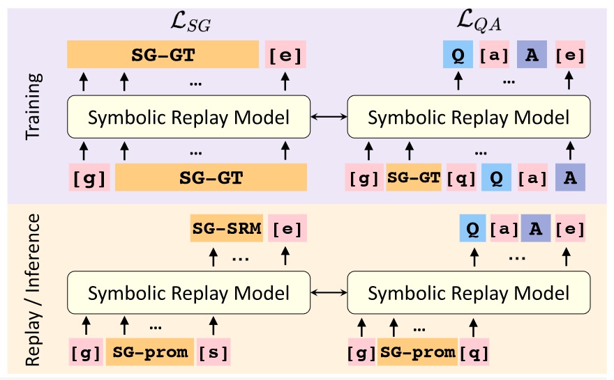
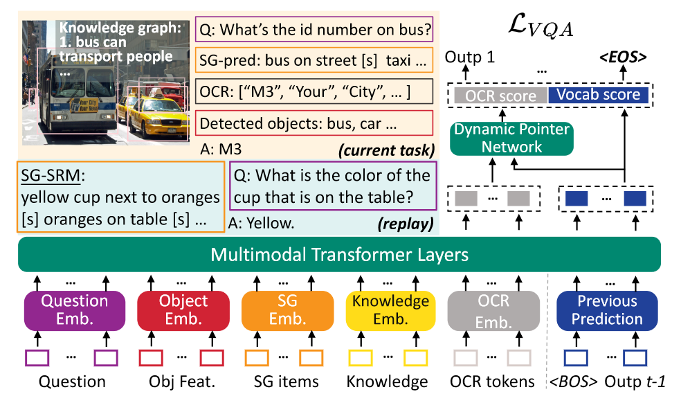

# Symbolic Replay: Scene Graph as Prompt for Continual Learning on VQA Task

## 背景

目前VQA系统经常在特定的数据集上训练，并且在使用中模型保持固定。但在现实，很难一次性就把VQA系统搭建好，因为用户的需求会持续性变化。VQA系统需要持续学习知识，无论是应用于新场景还是添加新功能。

在计算机视觉社区，有很多处理图像分类中持续学习（CL）的方法，模型需要按序处理不同的分类任务，每个人物的标签都不同。在这个任务下，模型会在视觉模态下持续提升识别这一种能力，并且主要学习每一类别的表示。而在VQA中，模型需要适应许多新的环境、学习许多新的能力。所以VQA任务中的CL，与图像分类任务不同，会在多种模态下持续学习新的能力，并且更关注于推理过程。因此，持续学习是搭建一个更好VQA系统的必要能力。

最近，一个开创新的工作将VQA数据集分成wh-和yes/no两个问答集来学习这一课题（Greco et al）。但是，这种划分方法很难让我们了解持续学习的新场景和新功能。具体来说，对于图形领域，wh-和yes/no问题都是关于几何范围的。对于功能来说，两种类型的问题都是关于物体属性和属性的多跳推理的。“*这个正方体是什么颜色？*”和“*这个正方体是红色的吗？*”两个问题其实涉及到同样的功能，知识问的方式不一样。

## CLOVE

本文通过将目前现存的VQA数据集进行重组织，构建出CLOVE，一个为VQA上持续学习的benchmark，包含着场景增量、功能增量两种CL设定。

1. 场景增量：VQA模型需要适应于新的场景。本文设置了购物和餐饮环境、工作环境、家庭旅店环境、交通、运动休闲、户外六种场景。

2. 功能增量：VQA模型需要适应新功能。本文设置了物体识别、属性识别、关系推理、逻辑推理、知识推理和场景文本理解六种功能。

具体来说，本文定义了包含$N$个VQA任务的序列，既$\mathbf{T} = (T_1, T_2, \cdots, T_N)$。其中第$i$个任务$T_i$利用任务特定的数据集$D_i = \{\mathbf{d}_1^i, \cdots, \mathbf{d}_n^i, \cdots, \mathbf{d}_{\left | D_i \right |}^i\}$。其中，$\mathbf{d}_n^i$代表着一个图像、问题、回答三元组$\{\mathbf{v}_n^i, \mathbf{q}_n^i, \mathbf{a}_n^i\}$。图像和问题是VQA模型的输入，我们期望会输出标准答案。

### 场景设定

#### 图像分配

为了给每个任务分配图像，本文依靠sota场景分类模型来获得一个初始的划分。接下来，本文使用两个后处理策略来提升已选图片的质量：

1. 利用分类置信分数阈值过滤照片。
2. 限制图片中频繁出现的物体数量。

最后，本文每个任务随机采样了100张图片，并让3个人评估场景准确率。结果显示平均准确率为91.0%。

#### 问题分配

当模型被应用于一个新场景时，会面临两种问题：

1. 问题与场景中的一个独特物体有关，需要模型预测这个物体的名称作为一个场景独特的答案。

2. 问题涉及到普通的概念，需要模型预测常见的答案。

本文的场景增量设定包含着两种类型的问题。每个任务都有一些常见回答，也有一些其他任务没有的回答。对每个任务，本文收集相似数量的常见回答和独特回答。另外，本文会平衡不同任务之间的样本数量，并按照GQA的方法对任务之间答案分布进行平衡，防止数据集偏置。

### 功能设定

#### 样本分配

对物体识别、属性识别、关系推理和逻辑推理任务，本文从GQA数据集中搜集。对知识推理和场景文本理解任务，本文分别从CRIC和TextVQA数据集中进行搜集。对每一种任务，本文定义了对应的操作集。

#### 分布均衡

对于每个任务，本文尽可能将样本数量控制到差不多。

### 评价度量

本文参照VQA v2，通过对10个答案进行软投票来计算每个问题的准确率。准确率被定义为：

$$\text{Acc(ans)} = \min \left \{\frac{\text{\#ans in annotation}}{3}, 1\right \}$$

令$a_{k,j}$为在$T_j(j\le k)$的留出测试集上的准确率，此时模型已从$T_1$到$T_k$进行了持续学习训练。在$T_k$的平均准确率被定义为$A_k = \frac{1}{k} \sum_{j = 1}^k a_{k,j}$。

### SGP方法

传统的CL大致分为两种方法：

- 防止遗忘：传统的在图像分类上的VQA被设计用来防止遗忘视觉模态上的表示。但这对CLVQA不适用，因为VQA需要多模态的推理。

- 回放：一些其他工作通过回放来保留历史知识，但由于隐私的担忧，一般CL不会用真实的数据而是用伪数据。但是，在CLVQA上回放伪数据会非常有挑战性，因为VQA任务需要复杂的视觉场景和细粒度的内容，而SOTA图像GAN模型很难准确生成想要的图片。并且，低分辨率的图像质量也会对生成数据的质量有影响。

本文提出一个用于VQA中CL的基于回放的无真实数据的方法，用场景图谱作为提示来进行符号回放（SGP）。场景图谱是一个简洁、结构化的视觉信息表示，SGP通过使用场景图谱替代图像进行回放可以有效解决上述限制。

具体来说，SGP包括了一个符号回放模型（SRM），表示为$S$；以及一个统一VQA模型（UniVQA），表示为$U$。

- SRM是一个语言模型，会持续性捕捉符号推理机制并学习特定任务中场景图谱和问答对的映射。在推理阶段，SRM将<场景图谱、问题、答案>三元组进行知识回溯。

- UniVQA用来适应不同VQA任务的多种类型的输入模态。利用目前任务的样本、符号回放的样本进行训练，使得UniVQA可以在学习新任务的过程中保留先前需要的知识。

另外，由于之前的真实数据不被保存，本文的框架可被用于各种涉及隐私的应用。

#### SRM

对于每个图片，本文会序列化场景图谱，并根据预测下一个token，这样会让$S$学习到图像的结构。令场景图谱为$\mathcal{G} = (g_1, g_2, \cdots, g_M)$，在训练中我们会最小化如下损失函数：

$$\mathcal{L}_{SG}(\theta) = - \sum_{|D|}\sum_m \log P(g_m|g_1, \cdots,g_{m-1};\theta)$$

其中，$P(g_m) = \text{softmax}(S(G_m))$，$G_m$代表着$g_m$的上下文token；$\theta$是$S$的参数；$D$是训练数据。通过不断补全下一个token，就可以实现生成场景图谱。

另外，本文也用$S$来监督问答生成任务。令$G_{qa}$为用来生成问答对的场景图谱关系，在训练中，本文会最小化如下损失函数：

$$\mathcal{L}_{QA}(\theta) = - \sum_{|D|} \log P(q,a|G_{qa};\theta)$$

其中，$P(q, a) = \text{softmax}(S(G_{qa}))$。整个过程也是一种接龙补全的策略。

整体的损失函数为：$\mathcal{L} = \mathcal{L}_{QA} + \lambda \mathcal{L}_{SG}$，其中$\lambda$为一个权重超参。

为了训练$S$（符号回放模型），$S$会训练补全场景图谱和生成问答。等到推理阶段，需要给定一个提示（经过统计实体、属性和关系后随机选择的）来补全场景图谱，并且生成问题和答案。

#### UniVQA

由于不同的任务涉及到不同的模态，所以本文的VQA模型的输入涉及到很多模态，包括问题、物体、场景图谱、知识、OCR token和之前的预测。

对于问题、场景图谱和知识，本文使用预训练BERT模型进行提取特征。对于视觉物体，本文使用Faster R-CNN进行提取特征，并将纹理特征和位置特征进行合并。对于OCR token，本文按照先前相关研究进行特征提取和表示。通过动态指针网络，生成的答案有可能是答案字典中的某个单词，也有可能是一个输入的OCR token。

总的来说，对于目前的任务，UniVQA会使用离线场景图谱生成模型来从图像中提取场景图谱，作为输入进行推理。对于回放的样本，UniVQA会利用SRM生成的场景图谱、问题和答案进行训练。需要注意的是，在实践中本文会在推理过程中将15%的目标特征进行蒙蔽，让$U$从场景图谱中获取视觉信息。

为了训练$U$，我们使用伪回放的样本和真实的样本，让$U$从目前和之前的任务中学习到知识。具体来说，对于任务$T_i(i > 1)$，本文会从前面$i-1$个任务中共生成$\gamma|D_i|$个样本（每个任务平均分配）。第$i$个VQA模型的损失函数为：

$$\begin{aligned}
\mathcal{L}_{VQA}(\phi) = &\mathbb{E}_{\{\mathbf{v},\mathbf{q}, \mathbf{a}\} \sim D_i}[\mathcal{L}(U(\mathbf{v},\mathbf{q};\phi),\mathbf{a})] + \\
&\mathbb{E}_{\{\mathbf{v},\mathbf{q}, \mathbf{a}\} \sim S_{i - 1}}[\mathcal{L}(U(\mathbf{v}',\mathbf{q}';\phi),\mathbf{a}')]
\end{aligned}$$

其中，$\phi$为$U$的参数、$\mathcal{L}$是答案预测损失。

## 实验

通过与不同现有的CL方法进行比较，本文展示了CLOVE的难度和SGP的有效性。

1. 用场景图谱生成回放是有必要的。
2. 使用随机生成场景图谱比保留场景图谱准确率没有下降很多。
3. 随着回放样本数量的增多，准确率会有所提升。
4. 模型的持续学习与任务顺序无明显关联。

## 个人感想

- 本文开创性为VQA提出了持续学习benchmark。
- 很巧妙的是用Transformer的decoder自回归结构来接龙生成问答和场景图谱，这样就不用额外的内存了。
- 对VQA任务进行了分类和划分，对我的分治思想有帮助。
- 利用场景图谱代替图片，有借鉴意义。

问题：

- VQA的图片是细粒度的，场景图谱无法涉及一些细节。
- 应该以问题为导向去寻找图片中的相关信息。
- 从准确率上看，还是有很大的进步空间的。
- 文本结构的图谱可解释性差。

拓展：

- 基于代码生成的思路或许可以尝试解决这个benchmark，也没有隐私问题。
- 可以使用AIGC技术生成图像，来解决隐私问题。
- 可以尝试对一个图结构进行编码和特征提取，让整个过程具备可解释性。
