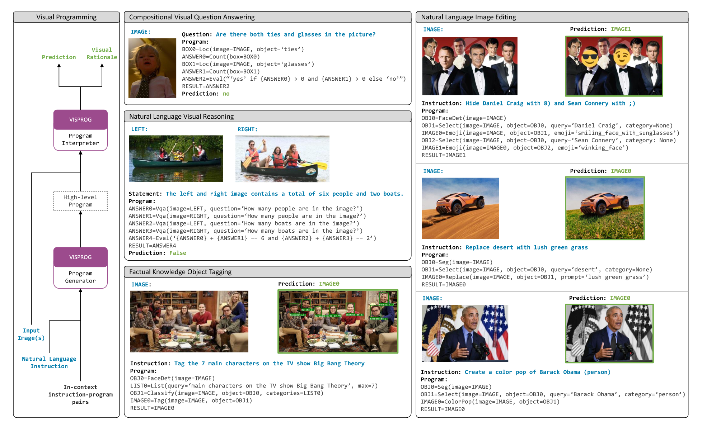

# Visual Programming: Compositional visual reasoning without training

## 简介

VISPROG模型完全不需要重新训练应用于特定任务。它会根据问题或指令，将其通过GPT-3进行上下文内学习，之后生成相关代码进行类似推理的过程，最后生成答案。非常花哨，但是好像很有用。

## 背景

对于通用AI系统的追求促进了端到端可训练模型的发展。构建这些系统的主要方法是大规模的无监督预训练+多任务监督训练。但是这种方法对每一个任务都需要一个质量很高的数据集，并且很难处理我们最终想实现的长尾复杂任务（相对不常见但是又很复杂）。

比如这条指令“把美剧《生活大爆炸》的七位主要角色标在图片上”。首先，系统需要先理解这个指令的意思，然后开始执行一系列步骤：检测脸部、从知识库中提取主要角色的列表、利用角色列表分类脸部、标记对应脸部为相应的角色名字。

## Visprog

### 基本介绍

本文的思路就是通过LLM，将长尾复杂任务转化为规则化的代码，再通过执行用一个个预训练模型或者微服务来解决。

visprog在之前方法的基础上进行了提升，首先内部模型不需要任何训练，可以直接调用，其次大模型只需要少量promt学习即可。并且，VISPROG内部调用的都是SOTA模型。

另外，visprog具有高度可解释性。一方面，大模型生成的是很好理解的代码，用户可以轻松检验逻辑的准确性。另一方面，由于visprog的程序执行是顺序执行，用户可以看到每一步的中间结果。

为了展示其灵活性，本文将其应用于四个任务：

1. VQA
2. **图片对**上的自然语言视觉推理
3. 根据指令对知识、事实类物体进行标注。
4. 图片编辑。

### 同类对比

ProgPrompt也是一种类似的根据自然语言指令给出对应的机器人动作，不过每个模块只接受一个字符串参数。而visprog能接收更多的参数。

### 处理任务

不同的任务，会用到不同的模块。

- **VQA**：数据集为GQA，使用开放字典图片定位、VQA、根据图片区域在各方向上裁剪图片的方程、计算物体框的数量、返回最终答案等微服务和模型。
- **基于图片对进行推理**：数据集为NLVRV2，使用VQA和返回最终答案模块。
- **事实知识物体标记**：自己搞了个数据集，用IoU评估。使用GPT-3作为知识库、图片分类、图片定位、人脸识别、打标签等微服务和模型。
- **自然语言编辑图像**：自己搞了个数据集，人工计算准确率。使用人脸识别、图像切割、选择区域、替换区域、突出显示某一颜色（把其他颜色变为黑白）、模糊图像背景、加入emoji表情等微服务和模型。

## 实验部分

首先，本文对GPT-3提供的promt数量进行研究。在GQA部分，通过随机选择对应的数量的prompt并进行多数投票，要比直接拿所有结果取平均值效果好。在NLVRv2部分，可以看到少量prompt就达到饱和了，这可能是因为NLVR设计到的模块很少，不需要太多案例进行学习。

经过visprog的GQA，效果比原VQA模型准确率有所提升。

在没有微调的情况下，相比于最强性能的VILT-NLVR，visprog表现出零样本学习的强大能力。

在图像标记和图像编辑任务中，也表现较为优异。

## 个人思考

- 将GPT-3作为知识库存在幻觉风险，应该将大模型与知识图谱相结合。

- 目前里面的一些模型可能已经有更好的了，要及时查阅资料并替代。

- VQA部分还是不可解释，一般就问个问题，返回对应的答案。

---

- （DocumentVQA）多图片问题如何解决？
- 增量学习模式（如果某一次答案不是我们想要的，如何下次规避这个问题？）
