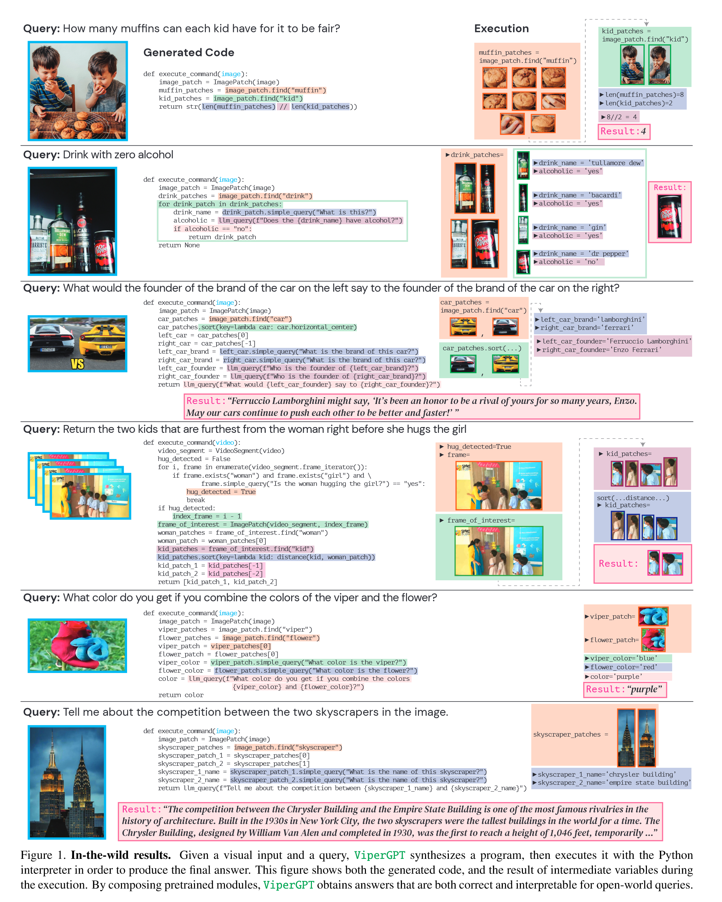

# ViperGPT: Visual Inference via Python Execution for Reasoning

## 背景

目前主流的、用于回答视觉请求任务的AI端到端模型并没有明显将视觉处理和推理区分开来，导致缺乏可解释性和泛化性。

## ViperGPT

七个优点：可解释性、逻辑性、灵活性、组合性、可适应性、无训练、通用性。

特点：

1. 生成Python代码并执行，具有多样性比如排序、遍历等。
2. API部分有增加，可以处理视频和图像。

## 实验

### 视觉定位

介绍：根据自然语言，在图片中选择最符合的物体。

Viper使用的模块：

- find(GLIP)：输入名词短语，输出包括这个名词短语的一个图片块列表。
- exists(GLIP)：输入名字短语，输出图片中是否存在这个实体。
- verify_property(X-VLM)：判断图片中某个名词短语是否存在某个特性。
- best_image_match(X-VLM)：选出最符合名词短语的图片块。
- best_text_match：输入一些名词短语和一张图片，输入最符合图片的名词短语。
- compute_depth(MiDaS)：计算图片块的平均深度。
- distance：两个图片块的像素距离。

### 组合型视觉问答

Viper使用的模块：

- simple_query(BLIP-2)：简单VQA模型。
- best_text_match：输入一些名词短语和一张图片，输入最符合图片的名词短语。

### 外沿知识视觉问答

Viper使用的模块：

- llm_query(GPT-3)：将GPT变为知识库，进行问答。

### 视频逻辑、时序推理

Viper使用的模块：

- select_answer(GPT-3)：给定场景描述和一系列可能的答案，回答最符合的答案。

## 新功能的探索

- 非询问的视觉语言模型：更加贴近日常生活的应用。
- 了解模型的参与情况，通过评估每个模块的对准确率做的性能，不断修改模型。

- 根据不同情况生成不同的结果：比如美国和英国的车道是不一样的。
